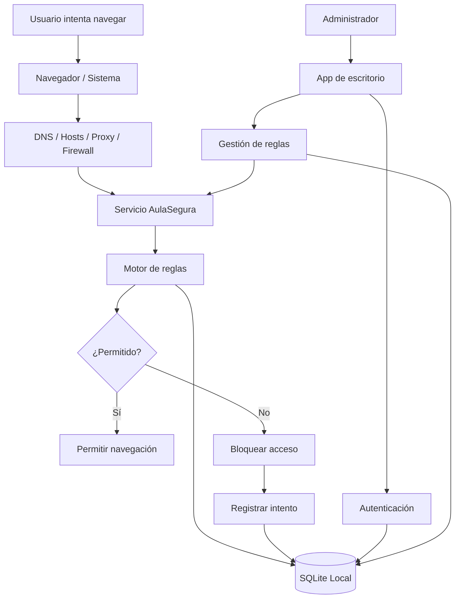
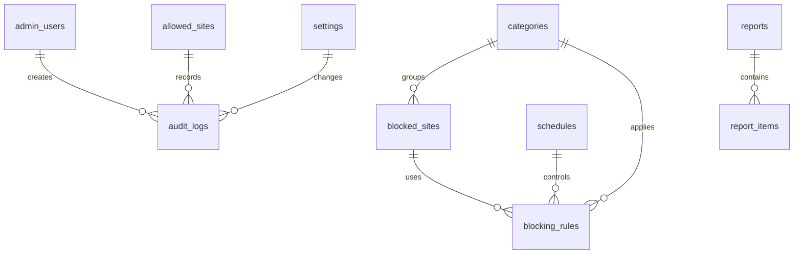

# EXPEDIENTE TÉCNICO DEL PROYECTO  
# **AulaSegura Control Web**  
## Aplicativo de escritorio para Windows orientado al bloqueo, control y administración del acceso a internet en escuelas y hogares

---

## Control del documento

| Campo | Detalle |
|---|---|
| Nombre del proyecto | **AulaSegura Control Web** |
| Tipo de documento | Expediente técnico funcional, técnico y operativo |
| Versión del documento | 1.0 |
| Fecha | 24 de abril de 2026 |
| Público objetivo | Instituciones educativas, hogares, aulas de cómputo, bibliotecas y centros formativos |
| Autor / equipo responsable | Equipo propuesto de análisis, arquitectura, desarrollo, ciberseguridad y soporte |
| Tipo de solución | Educativa, familiar, administrativa y preventiva |
| Plataforma objetivo | Microsoft Windows 10/11 y Windows Server para administración institucional |
| Estado del documento | Propuesta técnica lista para revisión, validación y planificación de desarrollo |

---

## Índice

1. [Supuestos del proyecto](#1-supuestos-del-proyecto)  
2. [Portada del expediente técnico](#2-portada-del-expediente-técnico)  
3. [Resumen ejecutivo](#3-resumen-ejecutivo)  
4. [Justificación del proyecto](#4-justificación-del-proyecto)  
5. [Objetivos del proyecto](#5-objetivos-del-proyecto)  
6. [Alcance funcional del sistema](#6-alcance-funcional-del-sistema)  
7. [Público objetivo](#7-público-objetivo)  
8. [Descripción general del aplicativo](#8-descripción-general-del-aplicativo)  
9. [Módulos principales del sistema](#9-módulos-principales-del-sistema)  
10. [Requerimientos funcionales](#10-requerimientos-funcionales)  
11. [Requerimientos no funcionales](#11-requerimientos-no-funcionales)  
12. [Reglas de negocio](#12-reglas-de-negocio)  
13. [Casos de uso](#13-casos-de-uso)  
14. [Historias de usuario](#14-historias-de-usuario)  
15. [Arquitectura técnica propuesta](#15-arquitectura-técnica-propuesta)  
16. [Tecnologías recomendadas](#16-tecnologías-recomendadas)  
17. [Estrategias de bloqueo web](#17-estrategias-de-bloqueo-web)  
18. [Diseño de base de datos](#18-diseño-de-base-de-datos)  
19. [Diseño de interfaz de usuario](#19-diseño-de-interfaz-de-usuario)  
20. [Seguridad del sistema](#20-seguridad-del-sistema)  
21. [Privacidad y ética](#21-privacidad-y-ética)  
22. [Flujo de funcionamiento paso a paso](#22-flujo-de-funcionamiento-paso-a-paso)  
23. [Plan de desarrollo por fases](#23-plan-de-desarrollo-por-fases)  
24. [Cronograma estimado](#24-cronograma-estimado)  
25. [Recursos necesarios](#25-recursos-necesarios)  
26. [Equipo de trabajo recomendado](#26-equipo-de-trabajo-recomendado)  
27. [Presupuesto referencial](#27-presupuesto-referencial)  
28. [Plan de pruebas](#28-plan-de-pruebas)  
29. [Riesgos del proyecto](#29-riesgos-del-proyecto)  
30. [Mantenimiento y soporte](#30-mantenimiento-y-soporte)  
31. [Manual básico de uso](#31-manual-básico-de-uso)  
32. [Recomendaciones técnicas finales](#32-recomendaciones-técnicas-finales)  
33. [Roadmap de futuras mejoras](#33-roadmap-de-futuras-mejoras)  
34. [Conclusiones](#34-conclusiones)  
35. [Anexos](#35-anexos)  
36. [Referencias técnicas recomendadas](#36-referencias-técnicas-recomendadas)

---

# 1. Supuestos del proyecto

Para elaborar este expediente se establecen los siguientes supuestos razonables:

| N.º | Supuesto | Descripción |
|---:|---|---|
| S-01 | Entorno principal | El aplicativo se instalará inicialmente en computadoras con Windows 10/11. |
| S-02 | Perfil de usuario | Los estudiantes, hijos o usuarios finales trabajarán con cuentas estándar de Windows, no con cuentas administradoras. |
| S-03 | Administrador autorizado | La configuración será gestionada por un padre de familia, tutor, coordinador TIC, docente responsable o administrador institucional. |
| S-04 | Instalación autorizada | La instalación se realizará con consentimiento del propietario del equipo o de la institución. |
| S-05 | Uso ético | El sistema no será usado para espionaje, robo de credenciales, vigilancia oculta ni interceptación indebida. |
| S-06 | Primera versión | La versión inicial funcionará de forma local en cada equipo, con opción futura de administración centralizada. |
| S-07 | Persistencia legítima | La protección contra cierre o desinstalación se hará mediante mecanismos normales de Windows: permisos, servicio, instalador con privilegios, políticas locales y auditoría. No se utilizarán técnicas ocultas, rootkits, malware ni manipulación no autorizada del sistema operativo. |
| S-08 | Filtros iniciales | La versión MVP bloqueará dominios, categorías y horarios. El filtrado avanzado por contenido interno de páginas HTTPS se considerará una fase posterior. |
| S-09 | Base de datos | Se utilizará SQLite local en la primera versión. Para versión institucional se podrá usar PostgreSQL, SQL Server, Supabase o Firebase. |
| S-10 | Reportes | Los reportes se limitarán a eventos de seguridad y bloqueo. Se evitará guardar más datos personales de los necesarios. |
| S-11 | Navegadores | Se dará soporte inicial a Microsoft Edge, Google Chrome, Mozilla Firefox y navegadores que respeten DNS/sistema/proxy. |
| S-12 | Red institucional | En escuelas, se recomienda complementar la app con filtrado DNS o firewall perimetral. |
| S-13 | Idioma | La interfaz estará en español. En una fase posterior se podrá agregar multiidioma. |
| S-14 | Nombre del producto | Se propone el nombre **AulaSegura Control Web**. Puede cambiarse por marca institucional. |

---

# 2. Portada del expediente técnico

## 2.1 Nombre propuesto del proyecto

**AulaSegura Control Web**  
Aplicativo de escritorio para Windows para el control parental, educativo y administrativo del acceso a internet.

## 2.2 Versión del documento

**Versión:** 1.0  
**Fecha de elaboración:** 24 de abril de 2026  
**Estado:** Propuesta técnica formal para revisión.

## 2.3 Público objetivo

- Instituciones educativas.
- Escuelas particulares, fiscales, fiscomisionales o centros de apoyo académico.
- Padres de familia.
- Tutores legales.
- Administradores de aulas de cómputo.
- Bibliotecas y centros comunitarios con acceso a internet.
- Hogares con niños, niñas y adolescentes.

## 2.4 Autor o equipo responsable

| Rol | Responsabilidad |
|---|---|
| Arquitecto de software | Diseño general de la solución y definición de componentes técnicos. |
| Analista funcional | Levantamiento de necesidades, reglas de negocio y casos de uso. |
| Especialista en ciberseguridad | Definición de controles, mitigación de riesgos y protección de configuración. |
| Desarrollador Windows | Construcción de aplicación de escritorio y servicio en segundo plano. |
| QA / tester | Pruebas funcionales, de bloqueo, instalación, seguridad y usabilidad. |
| Administrador de sistemas | Instalación, despliegue, soporte y mantenimiento en equipos. |

## 2.5 Tipo de solución

La solución se clasifica como:

- **Educativa:** protege entornos de aprendizaje.
- **Familiar:** permite a padres o tutores establecer límites de navegación.
- **Administrativa:** permite configurar políticas, reportes y reglas.
- **Preventiva:** reduce exposición a contenido inapropiado.
- **Parametrizable:** permite ajustar listas, categorías, horarios y excepciones.

---

# 3. Resumen ejecutivo

## 3.1 Descripción general del aplicativo

**AulaSegura Control Web** será una aplicación de escritorio para Windows diseñada para controlar, bloquear y administrar el acceso a sitios web, búsquedas y categorías de contenido no apropiadas para menores de edad o entornos educativos.

El aplicativo contará con:

- Interfaz gráfica para administradores.
- Servicio en segundo plano que aplica las reglas aunque la interfaz esté cerrada.
- Base de datos local para configuración, categorías, listas y registros.
- Sistema de bloqueo por dominio, categoría, lista negra, lista blanca y horario.
- Protección mediante contraseña.
- Reportes de intentos bloqueados.
- Copia de seguridad y restauración de configuración.
- Diseño preparado para evolucionar a administración centralizada.

## 3.2 Problema que resuelve

En escuelas y hogares, los menores pueden acceder a:

- Sitios para adultos.
- Pornografía.
- Contenido sexual explícito.
- Redes sociales no permitidas.
- Sitios de apuestas.
- Plataformas de juegos no autorizadas.
- Contenido violento o distractor.
- Búsquedas relacionadas con contenido inapropiado.

El bloqueo manual mediante el archivo `hosts` o configuraciones aisladas suele ser difícil de mantener, propenso a errores y fácil de modificar si el usuario tiene permisos elevados. Este proyecto propone una herramienta administrable, clara y segura.

## 3.3 Beneficios principales

| Beneficio | Descripción |
|---|---|
| Protección preventiva | Bloquea sitios y categorías antes de que el usuario acceda. |
| Administración simple | Permite configurar reglas desde una interfaz gráfica. |
| Control por categoría | Facilita bloquear grupos de sitios: adultos, redes sociales, apuestas, videojuegos, entretenimiento. |
| Registro de actividad | Permite revisar intentos bloqueados sin registrar datos excesivos. |
| Parametrización | Permite agregar, editar, activar o desactivar reglas. |
| Seguridad | Solicita contraseña para cambios críticos. |
| Escalabilidad | Puede iniciar local y crecer hacia administración centralizada. |
| Aplicación educativa | Se adapta a aulas de cómputo, laboratorios, bibliotecas y hogares. |

## 3.4 Alcance de la solución

La solución cubrirá:

- Bloqueo local de dominios.
- Gestión de listas negras.
- Gestión de listas blancas.
- Gestión de categorías.
- Horarios de bloqueo.
- Reportes.
- Logs de cambios.
- Configuración protegida.
- Servicio en segundo plano.
- Instalación y mantenimiento.

## 3.5 Usuarios beneficiados

| Usuario | Beneficio |
|---|---|
| Estudiantes | Entorno digital más seguro y enfocado. |
| Hijos menores de edad | Reducción de exposición a contenido no apropiado. |
| Padres de familia | Mayor control y tranquilidad. |
| Docentes | Mejor concentración durante actividades académicas. |
| Administradores TIC | Configuración uniforme y mantenible. |
| Directivos | Mejor gestión de riesgos digitales institucionales. |

---

# 4. Justificación del proyecto

## 4.1 Necesidad en escuelas y hogares

El acceso a internet es una herramienta esencial para el aprendizaje, pero también representa riesgos cuando no existen controles adecuados. En una escuela, las computadoras pueden ser utilizadas por distintos estudiantes en diferentes horarios. En el hogar, los menores pueden acceder a sitios no apropiados sin supervisión directa.

El proyecto se justifica porque permite establecer un ambiente digital controlado, seguro y alineado con objetivos educativos y familiares.

## 4.2 Riesgos del acceso libre a contenido para adultos

Los principales riesgos asociados al acceso sin control son:

- Exposición temprana a material sexual explícito.
- Normalización de conductas inadecuadas.
- Distracción en horas de estudio.
- Acceso a sitios con publicidad maliciosa.
- Posible contacto con contenidos engañosos o peligrosos.
- Riesgo de descarga de software no deseado.
- Acceso a juegos, apuestas o plataformas no permitidas.
- Uso excesivo de redes sociales durante clases o tareas.

## 4.3 Importancia del control parental y educativo

El control parental y educativo no debe entenderse como vigilancia invasiva, sino como una medida de protección, orientación y acompañamiento. La herramienta debe facilitar:

- Reglas claras.
- Uso responsable de internet.
- Transparencia con padres, docentes y estudiantes.
- Protección sin invadir innecesariamente la privacidad.
- Administración basada en roles y permisos.
- Reportes con datos mínimos y útiles.

## 4.4 Impacto esperado

| Área | Impacto esperado |
|---|---|
| Educación | Mejora de concentración y reducción de distracciones. |
| Seguridad digital | Menor exposición a contenidos inapropiados. |
| Administración | Control central o local de reglas. |
| Hogar | Mayor tranquilidad para padres y tutores. |
| Soporte técnico | Menos configuraciones manuales repetitivas. |
| Cumplimiento | Mayor trazabilidad de cambios y eventos. |

---

# 5. Objetivos del proyecto

## 5.1 Objetivo general

Desarrollar un aplicativo de escritorio para Windows que permita bloquear, controlar y administrar el acceso a páginas web, búsquedas y categorías de contenido inapropiado, orientado a entornos educativos y familiares, con configuración segura, registro de actividad y facilidad de uso.

## 5.2 Objetivos específicos

1. Permitir el bloqueo de sitios web mediante dominio.
2. Permitir el bloqueo de categorías completas.
3. Permitir listas negras personalizadas.
4. Permitir listas blancas para excepciones autorizadas.
5. Permitir bloqueo de redes sociales por horario.
6. Registrar intentos de acceso bloqueado.
7. Registrar cambios realizados por administradores.
8. Proteger la configuración mediante autenticación.
9. Ejecutar el motor de bloqueo en segundo plano.
10. Facilitar la instalación y uso por personal no técnico.

## 5.3 Objetivos técnicos

1. Diseñar una arquitectura modular.
2. Implementar una aplicación de escritorio para Windows.
3. Implementar un servicio de Windows para aplicación continua de reglas.
4. Utilizar una base de datos local ligera.
5. Cifrar configuraciones sensibles.
6. Validar entradas de dominios, palabras clave y horarios.
7. Implementar logs auditables.
8. Permitir respaldo y restauración.
9. Preparar el sistema para futura administración centralizada.
10. Crear documentación técnica y manual de usuario.

## 5.4 Objetivos de seguridad

1. Evitar cambios no autorizados.
2. Evitar que usuarios estándar cierren o desactiven el servicio.
3. Solicitar contraseña para cambios críticos.
4. Registrar todas las acciones administrativas.
5. Proteger archivos de configuración.
6. Restringir la desinstalación a usuarios autorizados.
7. Reducir la exposición de datos personales.
8. Evitar almacenamiento innecesario de historial completo.
9. Aplicar principios de mínimo privilegio.
10. Mantener actualizadas las reglas de bloqueo.

---

# 6. Alcance funcional del sistema

## 6.1 Qué hará la aplicación

La aplicación permitirá:

- Iniciar sesión como administrador.
- Cambiar contraseña administrativa.
- Bloquear sitios específicos.
- Desbloquear sitios específicos.
- Crear categorías personalizadas.
- Activar o desactivar categorías.
- Gestionar listas negras.
- Gestionar listas blancas.
- Bloquear redes sociales.
- Bloquear sitios de entretenimiento.
- Bloquear sitios de apuestas.
- Bloquear sitios de videojuegos.
- Configurar horarios de bloqueo.
- Registrar intentos bloqueados.
- Exportar reportes en CSV/PDF.
- Restaurar configuración predeterminada.
- Crear respaldos de configuración.
- Restaurar respaldos autorizados.
- Ejecutar reglas desde un servicio en segundo plano.
- Mostrar estado de protección.
- Notificar al administrador sobre errores críticos.

## 6.2 Qué no hará la aplicación

Por razones éticas, legales y técnicas, la aplicación no deberá:

- Robar contraseñas.
- Capturar teclado.
- Grabar pantalla.
- Espiar conversaciones privadas.
- Ocultarse como malware.
- Instalar rootkits.
- Bypassear controles de seguridad del sistema operativo.
- Interceptar tráfico cifrado sin consentimiento y configuración institucional formal.
- Recopilar historial completo innecesario.
- Sustituir completamente políticas de seguridad institucionales, firewall o controles de red.
- Garantizar bloqueo perfecto ante todos los métodos de evasión posibles, como VPN no controladas, redes externas o dispositivos personales sin la aplicación instalada.

## 6.3 Limitaciones iniciales

| Limitación | Descripción |
|---|---|
| HTTPS cifrado | La app no podrá leer todo el contenido interno de una página HTTPS sin un proxy institucional configurado legalmente. |
| VPN | Una VPN puede evadir ciertos controles si no se bloquea mediante políticas de sistema o firewall. |
| DNS-over-HTTPS | Algunos navegadores pueden usar DNS cifrado propio si no se administra su configuración. |
| Permisos de administrador | Si el usuario final tiene cuenta administradora, puede intentar modificar configuraciones del sistema. |
| Sitios nuevos | Se requerirá actualizar listas para dominios nuevos. |
| Falsos positivos | Algunos sitios legítimos podrían bloquearse si comparten dominios o categorías. |

## 6.4 Posibles ampliaciones futuras

- Administración remota por panel web.
- Sincronización con nube.
- Integración con Active Directory.
- Integración con políticas de grupo.
- Filtros por perfil de usuario.
- Clasificación automática con IA.
- Reportes automáticos por correo.
- Aplicación móvil para padres.
- Integración con routers o firewall institucional.
- Agente centralizado para escuelas con múltiples laboratorios.

---

# 7. Público objetivo

## 7.1 Escuelas

La aplicación puede instalarse en:

- Laboratorios de computación.
- Aulas con computadoras compartidas.
- Bibliotecas escolares.
- Salas de docentes.
- Equipos administrativos con restricciones específicas.

Beneficios para escuelas:

- Uso controlado del internet institucional.
- Reducción de distracciones.
- Protección de menores.
- Evidencia de intentos bloqueados.
- Administración por categorías.
- Mejor cumplimiento de políticas internas.

## 7.2 Padres de familia

Permite a padres:

- Bloquear contenido adulto.
- Definir horarios para redes sociales.
- Permitir sitios educativos.
- Revisar intentos de acceso bloqueado.
- Evitar configuraciones técnicas manuales.
- Proteger equipos familiares.

## 7.3 Tutores

Útil para tutores que administran equipos de uso compartido:

- Centros de tareas.
- Academias.
- Refuerzos escolares.
- Espacios comunitarios.

## 7.4 Administradores de aulas de cómputo

Permite:

- Aplicar reglas homogéneas.
- Respaldar configuración.
- Exportar reportes.
- Revisar equipos protegidos.
- Reducir mantenimiento manual.

## 7.5 Bibliotecas o centros educativos

En bibliotecas con equipos públicos se puede:

- Limitar contenidos no permitidos.
- Evitar uso indebido de computadoras.
- Mantener registros básicos de bloqueo.
- Proteger a usuarios menores de edad.

---

# 8. Descripción general del aplicativo

## 8.1 Funcionamiento básico

La solución se compone de dos partes principales:

1. **Aplicación de administración:** interfaz gráfica visible para el administrador.
2. **Servicio de protección:** componente en segundo plano encargado de aplicar reglas.

Flujo básico:

1. El equipo inicia Windows.
2. El servicio de protección se ejecuta automáticamente.
3. El servicio carga reglas desde la base local.
4. El usuario intenta abrir una página.
5. El motor de reglas verifica dominio, categoría, horario y listas.
6. Si la página está permitida, se deja navegar.
7. Si la página está bloqueada, se impide el acceso.
8. El intento queda registrado.
9. El administrador puede revisar reportes.

## 8.2 Interfaz de usuario

La interfaz debe ser clara, moderna y simple. Debe incluir:

- Menú lateral.
- Panel de estado general.
- Indicadores visuales de protección activa.
- Botones grandes y claros.
- Formularios con validación.
- Mensajes comprensibles.
- Tablas filtrables.
- Accesos rápidos para bloqueo/desbloqueo.
- Modo claro/oscuro opcional.

## 8.3 Panel de administración

El panel deberá mostrar:

- Estado de protección.
- Número de sitios bloqueados.
- Categorías activas.
- Intentos bloqueados del día.
- Última actualización de reglas.
- Últimos cambios administrativos.
- Acceso a reportes.
- Botón de emergencia para restaurar reglas predeterminadas.

## 8.4 Control de páginas bloqueadas

El administrador podrá:

- Agregar dominio.
- Editar dominio.
- Activar/desactivar dominio.
- Asignar categoría.
- Definir horario.
- Agregar observaciones.
- Eliminar o archivar regla.
- Importar listas.
- Exportar listas.

Ejemplos de dominios:

```text
adult-site-example.com
apuestas-example.com
red-social-example.com
juegos-example.com
```

## 8.5 Control de categorías

Categorías iniciales sugeridas:

| Categoría | Estado inicial | Descripción |
|---|---|---|
| Adultos / sexual explícito | Bloqueada | Contenido no apto para menores. |
| Apuestas | Bloqueada | Juegos de azar, apuestas deportivas, casinos. |
| Redes sociales | Configurable | Puede bloquearse siempre o por horario. |
| Videojuegos | Configurable | Puede bloquearse en horario escolar. |
| Streaming / entretenimiento | Configurable | Puede bloquearse durante clases. |
| Descargas riesgosas | Bloqueada | Sitios asociados a descargas sospechosas. |
| Sitios educativos | Permitida | Sitios de consulta académica. |

## 8.6 Protección mediante contraseña

La aplicación debe solicitar contraseña para:

- Abrir panel administrativo.
- Cambiar listas.
- Desactivar categoría.
- Desbloquear sitio.
- Restaurar configuración.
- Exportar reportes sensibles.
- Cambiar contraseña.
- Detener servicio.
- Desinstalar aplicación.

## 8.7 Registro de actividad

Se deberán registrar:

- Fecha y hora del evento.
- Equipo.
- Usuario de Windows.
- Sitio solicitado.
- Regla aplicada.
- Categoría.
- Acción: bloqueado, permitido, modificado, error.
- Administrador que realizó cambios.
- Motivo de cambio, si aplica.

No se recomienda registrar contenido de formularios, contraseñas ni información privada ingresada en páginas.

---

# 9. Módulos principales del sistema

## 9.1 Módulo de autenticación de administrador

| Elemento | Descripción |
|---|---|
| Objetivo | Permitir acceso seguro al panel de configuración. |
| Funciones | Login, cierre de sesión, cambio de contraseña, bloqueo por intentos fallidos. |
| Entradas | Usuario, contraseña, token local opcional. |
| Salidas | Sesión válida, mensaje de error, registro de intento. |
| Reglas de negocio | Después de 5 intentos fallidos, bloquear temporalmente el login administrativo. |
| Seguridad | Contraseña con hash Argon2id, bcrypt o PBKDF2; nunca texto plano. |

Funciones principales:

- Validar credenciales.
- Registrar intentos fallidos.
- Bloquear acceso temporal.
- Permitir cambio de contraseña.
- Cerrar sesión por inactividad.
- Aplicar política de contraseña fuerte.

## 9.2 Módulo de bloqueo de sitios web

| Elemento | Descripción |
|---|---|
| Objetivo | Bloquear dominios específicos. |
| Funciones | Agregar, editar, activar, desactivar, eliminar y validar dominios. |
| Entradas | Dominio, categoría, estado, horario, comentario. |
| Salidas | Regla aplicada, evento registrado, bloqueo efectivo. |
| Reglas de negocio | Dominios adultos deben bloquearse por defecto. |
| Seguridad | Validar formato para evitar entradas maliciosas. |

Ejemplo de regla:

```text
Dominio: red-social-example.com
Categoría: Redes sociales
Estado: Activo
Horario: Lunes a viernes, 07:00 a 15:00
Acción: Bloquear
```

## 9.3 Módulo de bloqueo de palabras clave en búsquedas

| Elemento | Descripción |
|---|---|
| Objetivo | Reducir búsquedas con términos inapropiados. |
| Funciones | Gestionar palabras clave, activar SafeSearch, reglas por navegador. |
| Entradas | Palabra clave, categoría, severidad, estado. |
| Salidas | Registro de intento, regla aplicada, redirección o bloqueo. |
| Reglas de negocio | Palabras asociadas a contenido adulto se bloquean por defecto. |
| Limitación | En HTTPS no siempre se podrá leer la búsqueda exacta sin configuración adicional. |

Estrategias recomendadas:

- Forzar SafeSearch cuando sea posible.
- Bloquear dominios de búsqueda alternativa no autorizada.
- Usar DNS filtrado.
- En versión avanzada, proxy local con consentimiento y certificado institucional.

## 9.4 Módulo de categorías bloqueadas

| Elemento | Descripción |
|---|---|
| Objetivo | Agrupar reglas por tipo de contenido. |
| Funciones | Crear, editar, activar, desactivar y programar categorías. |
| Entradas | Nombre, descripción, estado, color, horario. |
| Salidas | Categoría disponible para reglas. |
| Reglas de negocio | Categoría “Adultos” no puede eliminarse, solo actualizarse. |

Categorías base:

- Adultos.
- Apuestas.
- Redes sociales.
- Videojuegos.
- Streaming.
- Descargas riesgosas.
- Educación.
- Excepciones permitidas.

## 9.5 Módulo de redes sociales

| Elemento | Descripción |
|---|---|
| Objetivo | Controlar acceso a redes sociales. |
| Funciones | Bloqueo total, bloqueo por horario, excepciones. |
| Entradas | Red social, dominio, horario, perfil. |
| Salidas | Regla activa. |
| Reglas de negocio | En horario escolar, redes sociales se bloquean salvo autorización. |

Ejemplo:

| Red | Estado | Horario |
|---|---|---|
| Facebook | Bloqueado | Lunes-viernes 07:00-15:00 |
| Instagram | Bloqueado | Lunes-viernes 07:00-15:00 |
| TikTok | Bloqueado | Siempre |
| YouTube | Permitido con control | Solo canales educativos o por horario |

## 9.6 Módulo de listas blancas

| Elemento | Descripción |
|---|---|
| Objetivo | Permitir sitios aunque pertenezcan a una categoría bloqueada. |
| Funciones | Agregar excepciones, validar prioridad, registrar motivo. |
| Entradas | Dominio permitido, motivo, fecha de vigencia. |
| Salidas | Regla de permiso. |
| Reglas de negocio | La lista blanca tiene prioridad sobre lista negra solo si el administrador lo autoriza explícitamente. |

Ejemplo:

```text
Dominio: biblioteca-digital-example.edu
Motivo: Recurso educativo autorizado
Vigencia: Permanente
```

## 9.7 Módulo de listas negras

| Elemento | Descripción |
|---|---|
| Objetivo | Bloquear sitios específicos. |
| Funciones | Alta, baja, edición, importación masiva. |
| Entradas | Dominio, categoría, descripción. |
| Salidas | Regla de bloqueo. |
| Reglas de negocio | Los dominios críticos de adultos no se desactivan sin contraseña. |

## 9.8 Módulo de configuración general

| Elemento | Descripción |
|---|---|
| Objetivo | Gestionar parámetros globales del sistema. |
| Funciones | Idioma, tema, rutas, actualización, reportes, retención de logs. |
| Entradas | Preferencias del administrador. |
| Salidas | Configuración aplicada. |
| Reglas de negocio | Cambios críticos requieren contraseña. |

Parámetros:

- Nombre de institución/hogar.
- Modo escuela/hogar.
- Tiempo de sesión administrativa.
- Retención de logs.
- Modo de bloqueo.
- Ruta de respaldos.
- Frecuencia de actualización de listas.
- Nivel de severidad de bloqueo.

## 9.9 Módulo de reportes

| Elemento | Descripción |
|---|---|
| Objetivo | Presentar información clara sobre bloqueos y cambios. |
| Funciones | Filtrar, visualizar, exportar CSV/PDF. |
| Entradas | Rango de fechas, categoría, equipo, usuario. |
| Salidas | Reporte generado. |
| Reglas de negocio | Exportar reportes requiere permiso administrativo. |

Reportes sugeridos:

- Intentos bloqueados por día.
- Sitios más intentados.
- Categorías más bloqueadas.
- Cambios de configuración.
- Estado de protección.
- Equipos con errores.

## 9.10 Módulo de registros o logs

| Elemento | Descripción |
|---|---|
| Objetivo | Mantener trazabilidad técnica y administrativa. |
| Funciones | Guardar eventos, errores, bloqueos y cambios. |
| Entradas | Evento del sistema. |
| Salidas | Registro persistente. |
| Reglas de negocio | Los logs no pueden editarse desde la interfaz normal. |

Tipos de logs:

- Seguridad.
- Bloqueo.
- Configuración.
- Sistema.
- Errores.
- Instalación.
- Actualización.

## 9.11 Módulo de protección contra desinstalación o desactivación

| Elemento | Descripción |
|---|---|
| Objetivo | Evitar que usuarios no autorizados deshabiliten la protección. |
| Funciones | Servicio de Windows, permisos, contraseña, auditoría. |
| Entradas | Solicitud de detener, modificar o desinstalar. |
| Salidas | Autorización o denegación. |
| Reglas de negocio | Solo administrador autorizado puede detener o desinstalar. |
| Límite ético | No se implementarán técnicas ocultas ni maliciosas. |

Controles permitidos:

- Instalador con privilegios administrativos.
- Servicio configurado para iniciar automáticamente.
- Permisos NTFS en archivos de configuración.
- Cuenta estándar para menores/estudiantes.
- Registro de intento de detención.
- Desinstalación protegida con contraseña del instalador.
- Políticas locales de Windows en entorno institucional.

## 9.12 Módulo de actualización de reglas de bloqueo

| Elemento | Descripción |
|---|---|
| Objetivo | Mantener listas y categorías actualizadas. |
| Funciones | Importar, validar, aplicar y registrar actualizaciones. |
| Entradas | Archivo local, repositorio institucional o fuente autorizada. |
| Salidas | Reglas actualizadas. |
| Reglas de negocio | Toda actualización debe validarse antes de aplicarse. |

## 9.13 Módulo de respaldo y restauración de configuración

| Elemento | Descripción |
|---|---|
| Objetivo | Permitir recuperar configuración ante errores. |
| Funciones | Crear respaldo, restaurar respaldo, exportar configuración. |
| Entradas | Archivo de respaldo cifrado. |
| Salidas | Configuración restaurada. |
| Reglas de negocio | Restaurar requiere contraseña y genera log. |

---

# 10. Requerimientos funcionales

| Código | Nombre | Descripción | Prioridad | Usuario responsable | Criterio de aceptación |
|---|---|---|---|---|---|
| RF-001 | Inicio de sesión administrador | El sistema debe permitir acceso al panel solo con credenciales válidas. | Alta | Administrador | Si la contraseña es correcta, ingresa; si no, muestra error y registra intento. |
| RF-002 | Cambio de contraseña | El administrador debe poder cambiar su contraseña. | Alta | Administrador | La contraseña se actualiza y se guarda cifrada/hasheada. |
| RF-003 | Bloquear dominio | El administrador debe poder bloquear una página específica. | Alta | Administrador | Al intentar acceder al dominio, el acceso es bloqueado. |
| RF-004 | Desbloquear dominio | El administrador debe poder quitar bloqueo a una página. | Alta | Administrador | El dominio deja de bloquearse si no pertenece a otra regla activa. |
| RF-005 | Lista negra | El sistema debe administrar dominios bloqueados. | Alta | Administrador | Se puede agregar, editar, buscar y desactivar dominios. |
| RF-006 | Lista blanca | El sistema debe permitir excepciones autorizadas. | Alta | Administrador | El dominio permitido se respeta según prioridad definida. |
| RF-007 | Categorías | El sistema debe permitir gestionar categorías de contenido. | Alta | Administrador | Las reglas se agrupan por categoría. |
| RF-008 | Bloquear categoría | El administrador debe poder bloquear una categoría completa. | Alta | Administrador | Todos los dominios activos de esa categoría se bloquean. |
| RF-009 | Bloqueo de redes sociales | El sistema debe incluir categoría de redes sociales. | Alta | Administrador | Las redes configuradas se bloquean según horario o estado. |
| RF-010 | Bloqueo por horario | El sistema debe permitir reglas con horarios. | Media | Administrador | La regla se aplica solo en los rangos configurados. |
| RF-011 | Reportes | El sistema debe generar reportes de intentos bloqueados. | Alta | Administrador | El reporte muestra fecha, dominio, categoría y acción. |
| RF-012 | Exportar reportes | El administrador debe exportar reportes en CSV/PDF. | Media | Administrador | El archivo se genera correctamente. |
| RF-013 | Logs de cambios | Toda modificación debe quedar registrada. | Alta | Sistema | Cada cambio contiene fecha, usuario y detalle. |
| RF-014 | Servicio de Windows | El motor de bloqueo debe ejecutarse en segundo plano. | Alta | Sistema | Al reiniciar Windows, el servicio inicia automáticamente. |
| RF-015 | Estado de protección | La interfaz debe mostrar si la protección está activa. | Alta | Administrador | El panel muestra activo/inactivo/error. |
| RF-016 | Restaurar configuración | El administrador debe poder restaurar valores predeterminados. | Media | Administrador | La configuración vuelve al estado base y se registra. |
| RF-017 | Respaldo | El sistema debe permitir respaldar configuración. | Media | Administrador | Se genera archivo de respaldo válido. |
| RF-018 | Restauración desde respaldo | El sistema debe restaurar una configuración previa. | Media | Administrador | Se carga respaldo y se reinicia motor de reglas. |
| RF-019 | Importación masiva | Debe permitir cargar listas de dominios desde CSV. | Media | Administrador | Los dominios válidos se importan y los inválidos se reportan. |
| RF-020 | Validación de dominios | El sistema debe validar formato de dominios. | Alta | Sistema | No permite entradas vacías, inválidas o peligrosas. |
| RF-021 | Bloqueo por palabras clave | El sistema debe gestionar palabras clave sensibles. | Media | Administrador | Las palabras se guardan y se aplican según estrategia disponible. |
| RF-022 | SafeSearch | El sistema debe permitir activar búsqueda segura cuando aplique. | Media | Administrador | La configuración queda marcada y aplicada según navegador/DNS. |
| RF-023 | Notificaciones | El sistema debe mostrar alertas administrativas. | Baja | Sistema | Se informa error o actualización relevante. |
| RF-024 | Retención de logs | El administrador debe definir días de conservación. | Media | Administrador | Los logs antiguos se archivan o eliminan según política. |
| RF-025 | Auditoría de login | Deben registrarse accesos administrativos. | Alta | Sistema | Cada login exitoso/fallido queda registrado. |
| RF-026 | Protección de desinstalación | La desinstalación debe requerir autorización. | Alta | Administrador | Usuario estándar no puede desinstalar desde la app. |
| RF-027 | Bloqueo por perfil | El sistema debe preparar perfiles de reglas. | Baja | Administrador | Se puede crear perfil hogar/escuela en fase posterior. |
| RF-028 | Modo emergencia | Debe existir restauración segura ante error de bloqueo. | Media | Administrador | El administrador puede restaurar conectividad con contraseña. |
| RF-029 | Actualizar reglas | Debe permitir actualizar listas desde fuente autorizada. | Media | Administrador | Se valida fuente y se registra actualización. |
| RF-030 | Configuración inicial | Al instalar, debe ejecutar asistente de configuración. | Alta | Administrador | Se crea contraseña inicial y política base. |

---

# 11. Requerimientos no funcionales

## 11.1 Seguridad

| Código | Requerimiento | Criterio |
|---|---|---|
| RNF-SEG-001 | Contraseñas protegidas | Las contraseñas no se almacenarán en texto plano. |
| RNF-SEG-002 | Configuración cifrada | Datos sensibles deben cifrarse localmente. |
| RNF-SEG-003 | Mínimo privilegio | El usuario final debe operar con cuenta estándar. |
| RNF-SEG-004 | Auditoría | Accesos y cambios deben registrarse. |
| RNF-SEG-005 | Validación | Todas las entradas deben validarse. |
| RNF-SEG-006 | Integridad | Reglas críticas deben tener control de integridad. |

## 11.2 Rendimiento

| Código | Requerimiento | Criterio |
|---|---|---|
| RNF-REN-001 | Inicio rápido | La interfaz debe abrir en menos de 5 segundos en equipo recomendado. |
| RNF-REN-002 | Bajo consumo | El servicio no debe consumir recursos excesivos. |
| RNF-REN-003 | Respuesta de reglas | La consulta de reglas debe resolverse en milisegundos. |
| RNF-REN-004 | Importación | Debe importar listas medianas sin bloquear la interfaz. |

## 11.3 Compatibilidad con Windows

| Código | Requerimiento | Criterio |
|---|---|---|
| RNF-COM-001 | Windows 10/11 | Debe ser compatible con Windows 10/11. |
| RNF-COM-002 | Instalador | Debe incluir instalador MSI/MSIX o instalador firmado. |
| RNF-COM-003 | Servicio | Debe instalar un servicio de Windows. |
| RNF-COM-004 | Navegadores | Debe funcionar con navegadores comunes. |

## 11.4 Usabilidad

| Código | Requerimiento | Criterio |
|---|---|---|
| RNF-USA-001 | Interfaz clara | Un usuario no técnico debe poder bloquear una página en menos de 3 pasos. |
| RNF-USA-002 | Mensajes comprensibles | Los errores deben explicar causa y solución. |
| RNF-USA-003 | Accesibilidad | Debe usar tamaños legibles, contraste adecuado e iconos claros. |
| RNF-USA-004 | Idioma | La interfaz inicial será en español. |

## 11.5 Escalabilidad

| Código | Requerimiento | Criterio |
|---|---|---|
| RNF-ESC-001 | Modularidad | El motor de bloqueo debe separarse de la UI. |
| RNF-ESC-002 | Administración futura | La arquitectura debe permitir panel web futuro. |
| RNF-ESC-003 | Multi-equipo | Debe prepararse para sincronización centralizada. |

## 11.6 Mantenibilidad

| Código | Requerimiento | Criterio |
|---|---|---|
| RNF-MAN-001 | Código modular | Separación por capas. |
| RNF-MAN-002 | Logs técnicos | Errores técnicos deben registrarse. |
| RNF-MAN-003 | Documentación | Debe existir manual técnico y de usuario. |
| RNF-MAN-004 | Pruebas | Debe incluir pruebas unitarias y de integración. |

## 11.7 Disponibilidad

| Código | Requerimiento | Criterio |
|---|---|---|
| RNF-DIS-001 | Inicio automático | El servicio debe iniciar con Windows. |
| RNF-DIS-002 | Recuperación | Ante fallo, el servicio debe intentar reiniciar. |
| RNF-DIS-003 | Modo seguro | Debe existir forma autorizada de restaurar conectividad. |

## 11.8 Privacidad y protección de datos

| Código | Requerimiento | Criterio |
|---|---|---|
| RNF-PRI-001 | Minimización | Solo guardar datos necesarios. |
| RNF-PRI-002 | Retención | Definir tiempo de conservación de logs. |
| RNF-PRI-003 | Consentimiento | En escuelas, informar políticas de uso. |
| RNF-PRI-004 | Exportación controlada | Reportes solo con usuario autorizado. |

## 11.9 Facilidad de instalación

| Código | Requerimiento | Criterio |
|---|---|---|
| RNF-INS-001 | Asistente | Instalación guiada paso a paso. |
| RNF-INS-002 | Configuración inicial | Crear contraseña y política base al instalar. |
| RNF-INS-003 | Verificación | Al finalizar, validar que el servicio esté activo. |
| RNF-INS-004 | Desinstalación autorizada | Desinstalación con privilegios y contraseña administrativa. |

---

# 12. Reglas de negocio

| Código | Regla |
|---|---|
| RN-001 | Solo el administrador autorizado puede desbloquear páginas. |
| RN-002 | El usuario estándar no puede cerrar, detener ni modificar el servicio de protección. |
| RN-003 | Las páginas para adultos deben bloquearse por defecto. |
| RN-004 | La categoría de adultos no puede eliminarse, solo actualizarse. |
| RN-005 | Las redes sociales pueden activarse o desactivarse por horario. |
| RN-006 | Toda modificación debe quedar registrada con fecha, hora y administrador. |
| RN-007 | La aplicación debe solicitar contraseña para cambios críticos. |
| RN-008 | La lista blanca solo puede ser modificada por administrador. |
| RN-009 | Una regla de lista blanca debe tener motivo registrado. |
| RN-010 | Los logs no deben exponer contraseñas ni contenido sensible. |
| RN-011 | La exportación de reportes requiere autenticación. |
| RN-012 | Si el servicio falla, debe registrarse el error. |
| RN-013 | El sistema debe aplicar reglas al iniciar Windows. |
| RN-014 | Si una página pertenece a varias categorías, se aplicará la regla más restrictiva, salvo lista blanca autorizada. |
| RN-015 | Los cambios de horario no deben afectar reglas globales críticas. |
| RN-016 | Los dominios inválidos no pueden guardarse. |
| RN-017 | Las actualizaciones de reglas deben validarse antes de aplicarse. |
| RN-018 | La restauración de configuración debe generar registro. |
| RN-019 | El modo emergencia solo puede ejecutarlo el administrador. |
| RN-020 | En entorno escolar, se recomienda documentar la política de uso aceptable de internet. |

---

# 13. Casos de uso

## CU-001: Iniciar sesión como administrador

| Campo | Descripción |
|---|---|
| Nombre | Iniciar sesión como administrador |
| Actor principal | Administrador |
| Descripción | Permite acceder al panel de administración. |
| Precondiciones | La aplicación está instalada y existe una cuenta administrativa. |
| Postcondiciones | Se crea sesión administrativa temporal. |

**Flujo principal:**

1. El administrador abre la aplicación.
2. El sistema muestra pantalla de login.
3. El administrador ingresa usuario y contraseña.
4. El sistema valida credenciales.
5. El sistema registra el intento.
6. El sistema abre el panel principal.

**Flujos alternativos:**

- A1: Contraseña incorrecta.
  1. El sistema muestra mensaje de error.
  2. Registra intento fallido.
  3. Permite reintentar.

- A2: Demasiados intentos fallidos.
  1. El sistema bloquea temporalmente el login.
  2. Registra evento de seguridad.

**Excepciones:**

- Base de datos inaccesible.
- Servicio no activo.
- Cuenta administrativa no creada.

---

## CU-002: Bloquear una página específica

| Campo | Descripción |
|---|---|
| Nombre | Bloquear página específica |
| Actor principal | Administrador |
| Descripción | Agrega un dominio a la lista negra. |
| Precondiciones | Administrador autenticado. |
| Postcondiciones | Dominio bloqueado. |

**Flujo principal:**

1. Administrador ingresa a “Páginas bloqueadas”.
2. Selecciona “Agregar sitio”.
3. Escribe dominio.
4. Selecciona categoría.
5. Define estado activo.
6. Opcionalmente define horario.
7. Guarda.
8. El sistema valida dominio.
9. El sistema registra cambio.
10. El servicio aplica la regla.

**Flujos alternativos:**

- A1: Dominio inválido.
  1. Sistema rechaza la entrada.
  2. Muestra formato correcto.

- A2: Dominio ya existe.
  1. Sistema informa duplicado.
  2. Permite actualizar regla existente.

**Excepciones:**

- Sin permisos.
- Error al sincronizar con motor de bloqueo.

---

## CU-003: Desbloquear una página específica

| Campo | Descripción |
|---|---|
| Nombre | Desbloquear página |
| Actor principal | Administrador |
| Descripción | Desactiva o elimina una regla de bloqueo. |
| Precondiciones | Administrador autenticado. |
| Postcondiciones | Dominio deja de bloquearse si no existe otra regla activa. |

**Flujo principal:**

1. Administrador busca dominio.
2. Selecciona regla.
3. Presiona “Desbloquear” o “Desactivar”.
4. El sistema solicita confirmación.
5. El administrador ingresa contraseña si es regla crítica.
6. El sistema registra motivo.
7. El sistema actualiza la regla.
8. El servicio recarga reglas.

**Flujos alternativos:**

- A1: Sitio pertenece a categoría bloqueada.
  1. El sistema informa que sigue bloqueado por categoría.
  2. Sugiere crear lista blanca.

**Excepciones:**

- Contraseña incorrecta.
- Servicio no disponible.

---

## CU-004: Bloquear una categoría completa

| Campo | Descripción |
|---|---|
| Nombre | Bloquear categoría |
| Actor principal | Administrador |
| Descripción | Activa bloqueo de todos los dominios asociados a una categoría. |
| Precondiciones | Categoría existente. |
| Postcondiciones | Categoría queda bloqueada. |

**Flujo principal:**

1. Administrador ingresa a “Categorías”.
2. Selecciona categoría.
3. Cambia estado a “Bloqueada”.
4. Define horario o bloqueo permanente.
5. Guarda.
6. Sistema registra cambio.
7. Servicio aplica regla.

**Flujos alternativos:**

- A1: Categoría con lista blanca.
  1. Sistema mantiene excepciones autorizadas.
  2. Registra prioridad aplicada.

**Excepciones:**

- Categoría protegida no puede eliminarse.
- Error en base de datos.

---

## CU-005: Bloquear redes sociales

| Campo | Descripción |
|---|---|
| Nombre | Bloquear redes sociales |
| Actor principal | Administrador |
| Descripción | Permite bloquear redes sociales de forma total o por horario. |
| Precondiciones | Categoría redes sociales configurada. |
| Postcondiciones | Redes sociales bloqueadas según regla. |

**Flujo principal:**

1. Administrador entra a “Redes sociales”.
2. Selecciona redes a bloquear.
3. Define bloqueo permanente o por horario.
4. Guarda.
5. Sistema valida reglas.
6. Servicio aplica cambios.

**Flujos alternativos:**

- A1: Permitir una red específica.
  1. Administrador agrega excepción a lista blanca.
  2. Sistema registra motivo.

**Excepciones:**

- Regla de horario mal configurada.

---

## CU-006: Permitir una página mediante lista blanca

| Campo | Descripción |
|---|---|
| Nombre | Permitir página |
| Actor principal | Administrador |
| Descripción | Crea una excepción para un dominio autorizado. |
| Precondiciones | Administrador autenticado. |
| Postcondiciones | Dominio permitido según prioridad. |

**Flujo principal:**

1. Administrador entra a “Lista blanca”.
2. Agrega dominio.
3. Escribe motivo.
4. Define vigencia.
5. Guarda.
6. Sistema valida.
7. Sistema registra cambio.
8. Motor aplica excepción.

**Flujos alternativos:**

- A1: Excepción temporal.
  1. Se define fecha de expiración.
  2. Al vencer, se desactiva automáticamente.

**Excepciones:**

- Dominio inválido.
- Motivo vacío.

---

## CU-007: Revisar historial de intentos bloqueados

| Campo | Descripción |
|---|---|
| Nombre | Revisar historial |
| Actor principal | Administrador |
| Descripción | Consulta intentos de acceso bloqueado. |
| Precondiciones | Existen logs. |
| Postcondiciones | Administrador visualiza eventos. |

**Flujo principal:**

1. Administrador abre “Reportes”.
2. Selecciona rango de fechas.
3. Aplica filtros.
4. Sistema muestra tabla.
5. Administrador revisa detalles.

**Flujos alternativos:**

- A1: No existen datos.
  1. Sistema muestra mensaje informativo.

**Excepciones:**

- Error al leer logs.

---

## CU-008: Exportar reporte

| Campo | Descripción |
|---|---|
| Nombre | Exportar reporte |
| Actor principal | Administrador |
| Descripción | Genera archivo CSV o PDF con eventos. |
| Precondiciones | Administrador autenticado y reportes disponibles. |
| Postcondiciones | Archivo generado. |

**Flujo principal:**

1. Administrador filtra reporte.
2. Selecciona formato.
3. Presiona “Exportar”.
4. Sistema solicita confirmación.
5. Sistema genera archivo.
6. Sistema registra exportación.

**Flujos alternativos:**

- A1: Sin datos.
  1. Sistema informa que no hay eventos para exportar.

**Excepciones:**

- Ruta sin permisos.
- Error al generar archivo.

---

## CU-009: Cambiar contraseña de administrador

| Campo | Descripción |
|---|---|
| Nombre | Cambiar contraseña |
| Actor principal | Administrador |
| Descripción | Actualiza clave administrativa. |
| Precondiciones | Sesión activa. |
| Postcondiciones | Contraseña actualizada. |

**Flujo principal:**

1. Administrador entra a “Seguridad”.
2. Ingresa contraseña actual.
3. Ingresa nueva contraseña.
4. Confirma nueva contraseña.
5. Sistema valida política.
6. Sistema actualiza hash.
7. Sistema registra cambio.

**Flujos alternativos:**

- A1: Contraseña débil.
  1. Sistema rechaza cambio.
  2. Muestra requisitos.

**Excepciones:**

- Contraseña actual incorrecta.

---

## CU-010: Restaurar configuración predeterminada

| Campo | Descripción |
|---|---|
| Nombre | Restaurar configuración |
| Actor principal | Administrador |
| Descripción | Restablece políticas base. |
| Precondiciones | Administrador autenticado. |
| Postcondiciones | Configuración base restaurada. |

**Flujo principal:**

1. Administrador entra a “Restauración”.
2. Selecciona “Restaurar predeterminado”.
3. Sistema muestra advertencia.
4. Administrador confirma.
5. Ingresa contraseña.
6. Sistema crea respaldo previo.
7. Sistema restaura valores base.
8. Servicio recarga reglas.
9. Se registra evento.

**Flujos alternativos:**

- A1: Cancelación.
  1. Administrador cancela.
  2. No se realizan cambios.

**Excepciones:**

- Error al crear respaldo.
- Servicio no responde.

---

# 14. Historias de usuario

| Código | Historia de usuario | Criterios de aceptación |
|---|---|---|
| HU-001 | Como administrador, quiero iniciar sesión con contraseña, para evitar que estudiantes modifiquen reglas. | Debe validar credenciales, registrar intento y bloquear tras varios fallos. |
| HU-002 | Como padre de familia, quiero bloquear páginas para adultos, para proteger a mis hijos. | La categoría adultos debe venir bloqueada por defecto. |
| HU-003 | Como coordinador TIC, quiero bloquear redes sociales por horario, para evitar distracciones durante clases. | Debe permitir rango de días y horas. |
| HU-004 | Como administrador, quiero permitir un sitio educativo, para que no sea bloqueado por error. | Debe agregarse a lista blanca con motivo. |
| HU-005 | Como docente, quiero revisar reportes de bloqueos, para identificar intentos repetidos de acceso no permitido. | Debe filtrar por fecha, categoría y equipo. |
| HU-006 | Como administrador, quiero exportar reportes, para presentar evidencia a directivos. | Debe exportar CSV/PDF con datos mínimos. |
| HU-007 | Como padre, quiero cambiar la contraseña, para mantener segura la configuración. | Debe pedir contraseña actual y validar la nueva. |
| HU-008 | Como administrador TIC, quiero importar listas de dominios, para configurar muchos sitios rápidamente. | Debe importar CSV y reportar errores. |
| HU-009 | Como usuario no técnico, quiero una interfaz sencilla, para configurar bloqueos sin conocimientos avanzados. | Debe permitir agregar bloqueo en pocos pasos. |
| HU-010 | Como institución, quiero respaldar configuración, para restaurar rápidamente en caso de falla. | Debe generar respaldo y permitir restaurarlo con autorización. |
| HU-011 | Como administrador, quiero que el sistema inicie con Windows, para mantener protección aunque nadie abra la app. | El servicio debe iniciar automáticamente. |
| HU-012 | Como directivo, quiero que los cambios queden registrados, para mantener trazabilidad. | Debe registrar quién cambió qué y cuándo. |

---

# 15. Arquitectura técnica propuesta

## 15.1 Enfoque arquitectónico

Se recomienda una arquitectura modular compuesta por:

1. **Aplicación de escritorio:** interfaz para administración.
2. **Servicio de Windows:** motor de aplicación de reglas.
3. **Base de datos local:** configuración y logs.
4. **Motor de reglas:** decide si bloquear o permitir.
5. **Adaptadores de bloqueo:** hosts, DNS, firewall, proxy local.
6. **Sistema de logs:** auditoría técnica y administrativa.
7. **Módulo de seguridad:** hash, cifrado, permisos y validaciones.
8. **Módulo de respaldo:** exportación/restauración cifrada.

## 15.2 Diagrama lógico



## 15.3 Componentes principales

| Componente | Función |
|---|---|
| AulaSegura.App | Aplicación gráfica de administración. |
| AulaSegura.Service | Servicio en segundo plano. |
| AulaSegura.Core | Lógica de negocio, reglas y validaciones. |
| AulaSegura.Data | Acceso a SQLite. |
| AulaSegura.Security | Hash, cifrado, permisos, validaciones. |
| AulaSegura.Blocking | Adaptadores de bloqueo: hosts, DNS, firewall, proxy. |
| AulaSegura.Reporting | Generación de reportes. |
| AulaSegura.Updater | Actualización de reglas. |
| AulaSegura.Installer | Instalador y desinstalador autorizado. |

## 15.4 Capas recomendadas

```text
src/
 ├─ AulaSegura.App/              Interfaz gráfica
 ├─ AulaSegura.Service/          Servicio de Windows
 ├─ AulaSegura.Core/             Reglas de negocio
 ├─ AulaSegura.Data/             Repositorios y SQLite
 ├─ AulaSegura.Security/         Cifrado, hash, validación
 ├─ AulaSegura.Blocking/         Hosts, DNS, Firewall, Proxy
 ├─ AulaSegura.Reporting/        Reportes CSV/PDF
 ├─ AulaSegura.Tests/            Pruebas automatizadas
 └─ AulaSegura.Installer/        Instalador
```

## 15.5 Aplicación de escritorio para Windows

La aplicación gráfica debe:

- No aplicar directamente reglas críticas.
- Comunicarse con el servicio por IPC local seguro.
- Validar credenciales.
- Mostrar estado.
- Gestionar listas y categorías.
- Solicitar confirmación para cambios sensibles.
- Registrar acciones administrativas.

## 15.6 Servicio en segundo plano

El servicio debe:

- Iniciar con Windows.
- Cargar reglas.
- Supervisar integridad de configuración.
- Aplicar reglas.
- Registrar errores.
- Recargar reglas al detectar cambios.
- Exponer canal local seguro para la interfaz.
- Reiniciarse ante errores controlados.

## 15.7 Base de datos local

SQLite será suficiente para una primera versión porque:

- No requiere servidor.
- Es liviana.
- Funciona con archivo local.
- Es fácil de respaldar.
- Es adecuada para configuración y logs locales.

## 15.8 Motor de reglas de bloqueo

El motor deberá evaluar en este orden:

1. Validación de dominio.
2. Lista blanca activa.
3. Regla crítica global.
4. Categoría bloqueada.
5. Lista negra.
6. Horario.
7. Política por usuario/perfil.
8. Decisión final: permitir o bloquear.

## 15.9 Configuración cifrada

Se recomienda:

- Cifrar secretos con DPAPI de Windows o mecanismo equivalente.
- No guardar contraseñas reversibles.
- Usar hash seguro para contraseña administrativa.
- Firmar o proteger archivos de configuración.
- Validar integridad de respaldos.

---

# 16. Tecnologías recomendadas

## 16.1 Comparativa de tecnologías

| Opción | Ventajas | Desventajas | Uso recomendado |
|---|---|---|---|
| C# + .NET + WPF | Maduro, estable, excelente integración con Windows. | UI menos moderna que WinUI si no se diseña bien. | Buena opción empresarial. |
| C# + .NET + WinUI 3 | Interfaz moderna estilo Windows 11, buena experiencia visual. | Curva de aprendizaje y empaquetado más exigente. | Recomendado para UI moderna. |
| C# + .NET Worker Service | Ideal para servicio en segundo plano. | Requiere permisos de instalación. | Recomendado para motor de bloqueo. |
| Python + PyQt | Desarrollo rápido, buena UI. | Distribución y seguridad menos limpias en Windows empresarial. | Prototipo rápido, no ideal para producto final crítico. |
| Python + Tkinter | Simple y rápido. | Interfaz básica, menos profesional. | Herramientas internas pequeñas. |
| Electron + Node.js | UI web moderna, multiplataforma. | Alto consumo de RAM y mayor superficie de ataque. | Panel administrativo visual, no ideal para servicio bajo nivel. |
| Rust | Alto rendimiento y seguridad de memoria. | Mayor complejidad para UI y equipo. | Servicio avanzado de bajo nivel. |
| Go | Binarios simples, buen rendimiento. | UI nativa limitada. | Servicios y herramientas auxiliares. |
| SQLite | Liviano, local, sin servidor. | No ideal para administración masiva multi-equipo. | Recomendado para MVP local. |
| SQL Server/PostgreSQL | Robusto para centralizar datos. | Requiere servidor. | Versión institucional. |
| Windows Service | Ejecuta protección aunque la UI esté cerrada. | Requiere instalación con permisos. | Esencial para el proyecto. |
| Firewall de Windows | Controla conexiones. | Gestión detallada puede ser compleja. | Complemento avanzado. |
| Archivo hosts | Simple para bloquear dominios. | Limitado, no maneja comodines bien, requiere permisos. | MVP controlado. |
| DNS filtrado | Bloquea por resolución de nombres. | Puede evadirse si hay DNS alternativo/DoH. | Muy recomendable. |
| Proxy local | Permite control avanzado. | Mayor complejidad y consideraciones legales. | Versión avanzada. |

## 16.2 Recomendación final

Para una solución profesional, segura y mantenible se recomienda:

| Capa | Tecnología recomendada |
|---|---|
| Lenguaje principal | C# |
| Plataforma | .NET 10 LTS |
| UI | WinUI 3 o WPF con diseño moderno |
| Servicio | .NET Worker Service instalado como Windows Service |
| Base local | SQLite |
| ORM | Entity Framework Core o Dapper según complejidad |
| Reportes | QuestPDF, ClosedXML o librería equivalente |
| Instalador | MSIX, MSI o WiX Toolset |
| Seguridad | DPAPI, Argon2id/bcrypt/PBKDF2, permisos NTFS |
| Logs | Serilog o Microsoft.Extensions.Logging |
| Bloqueo MVP | Hosts + DNS filtrado + reglas locales |
| Bloqueo avanzado | DNS controlado + firewall + proxy local institucional |

## 16.3 Arquitectura tecnológica recomendada para MVP

```text
Windows 10/11
 ├─ AulaSegura.App          WinUI/WPF
 ├─ AulaSegura.Service      Windows Service
 ├─ AulaSegura.Core         Motor de reglas
 ├─ AulaSegura.Data         SQLite
 ├─ AulaSegura.Blocking     Hosts + DNS + Firewall básico
 └─ AulaSegura.Reporting    CSV/PDF
```

---

# 17. Estrategias de bloqueo web

## 17.1 Bloqueo mediante archivo hosts

### Descripción

El archivo `hosts` permite mapear dominios a direcciones IP locales o no válidas para impedir su resolución.

Ejemplo conceptual:

```text
127.0.0.1 adult-site-example.com
127.0.0.1 www.adult-site-example.com
```

### Ventajas

- Simple.
- No requiere software de red complejo.
- Funciona a nivel del sistema operativo.
- Útil para MVP.

### Desventajas

- Requiere permisos administrativos.
- No maneja categorías automáticamente.
- No maneja comodines de forma nativa.
- Puede ser modificado por usuarios administradores.
- No bloquea si se accede por IP directa.
- No cubre todos los subdominios si no se listan.

### Recomendación

Usarlo en la primera versión como mecanismo simple, combinado con protección de permisos y servicio.

## 17.2 Bloqueo mediante DNS

### Descripción

Consiste en resolver dominios bloqueados hacia una página de bloqueo o impedir su resolución.

### Ventajas

- Eficiente.
- Centralizable.
- Adecuado para escuelas.
- Puede aplicarse a toda la red.

### Desventajas

- Puede evadirse con DNS externo, VPN o DNS-over-HTTPS si no se controla.
- Requiere configuración de red o política de navegador.

### Recomendación

Muy recomendable para versión escolar, especialmente si se combina con firewall y configuración de router.

## 17.3 Bloqueo mediante firewall

### Descripción

Usa reglas de Firewall de Windows o firewall perimetral para bloquear conexiones.

### Ventajas

- Controla tráfico de aplicaciones o puertos.
- Puede bloquear VPNs conocidas o aplicaciones no permitidas.
- Útil para endurecer el equipo.

### Desventajas

- Administrar dominios dinámicos es difícil.
- Muchas plataformas cambian IPs.
- Puede generar falsos positivos.

### Recomendación

Usarlo como complemento, no como único mecanismo.

## 17.4 Bloqueo mediante proxy local

### Descripción

El navegador envía tráfico a un proxy local que decide permitir o bloquear.

### Ventajas

- Mayor control.
- Permite página de bloqueo personalizada.
- Puede aplicar reglas por usuario y horario.
- Puede clasificar URLs con más detalle.

### Desventajas

- Configuración más compleja.
- HTTPS requiere diseño legal, ético y técnico cuidadoso.
- Puede afectar rendimiento.
- Necesita certificado institucional para inspección avanzada, solo con consentimiento.

### Recomendación

Usarlo en versión avanzada, especialmente en entornos institucionales con política formal.

## 17.5 Bloqueo mediante extensión de navegador

### Descripción

Extensión instalada en el navegador que bloquea URLs.

### Ventajas

- Permite control de URL más detallado.
- Fácil de mostrar mensajes.
- Útil para navegadores específicos.

### Desventajas

- Debe instalarse por navegador.
- Puede desactivarse si no hay políticas.
- No cubre otros navegadores.

### Recomendación

Usar como complemento, no como control principal.

## 17.6 Bloqueo por palabras clave

### Descripción

Bloquea búsquedas o URLs que contienen términos específicos.

### Ventajas

- Útil para búsquedas no permitidas.
- Permite ajustar términos educativos.

### Desventajas

- En HTTPS puede no verse la búsqueda.
- Puede generar falsos positivos.
- Requiere mantenimiento.

### Recomendación

Aplicar junto con SafeSearch y DNS filtrado.

## 17.7 Bloqueo por categorías

### Descripción

Agrupa sitios en categorías: adultos, redes sociales, apuestas, videojuegos, etc.

### Ventajas

- Fácil para administradores.
- Escalable.
- Menos trabajo manual.

### Desventajas

- Requiere base de datos de dominios actualizada.
- Puede haber errores de clasificación.

### Recomendación

Debe ser parte central del sistema.

## 17.8 Bloqueo por listas negras

### Descripción

Lista explícita de sitios prohibidos.

### Ventajas

- Control preciso.
- Fácil de entender.
- Ideal para instituciones pequeñas.

### Desventajas

- Requiere mantenimiento.
- No cubre sitios nuevos.

### Recomendación

Necesario en MVP.

## 17.9 Bloqueo por listas blancas

### Descripción

Lista de sitios permitidos, incluso si pertenecen a categorías bloqueadas.

### Ventajas

- Reduce falsos positivos.
- Permite recursos educativos.
- Da control fino.

### Desventajas

- Si se usa mal, puede abrir excepciones peligrosas.
- Requiere revisión.

### Recomendación

Necesario desde la primera versión.

## 17.10 Estrategia recomendada para primera versión

Para MVP:

1. Aplicación de escritorio.
2. Servicio de Windows.
3. SQLite.
4. Bloqueo por archivo hosts administrado.
5. DNS filtrado recomendado.
6. Categorías locales.
7. Listas negras/blancas.
8. Horarios.
9. Logs y reportes.
10. Protección con contraseña.

## 17.11 Estrategia recomendada para versión avanzada

Para versión institucional avanzada:

1. Consola web central.
2. Agentes instalados en equipos.
3. DNS institucional filtrado.
4. Políticas de navegador.
5. Firewall perimetral.
6. Proxy local o institucional.
7. Integración con Active Directory.
8. Reportes centralizados.
9. Perfiles por grado/aula/usuario.
10. IA para clasificación asistida.

---

# 18. Diseño de base de datos

## 18.1 Motor propuesto

**SQLite local** para MVP.

Ventajas:

- Archivo único.
- Fácil respaldo.
- Sin servidor.
- Buen rendimiento para configuración y logs.
- Integración sencilla con .NET.

## 18.2 Diagrama entidad-relación conceptual



## 18.3 Tablas principales

### 18.3.1 Tabla `admin_users`

| Campo | Tipo | Restricción | Descripción |
|---|---|---|---|
| id | INTEGER | PK AUTOINCREMENT | Identificador. |
| username | TEXT | UNIQUE NOT NULL | Usuario administrador. |
| password_hash | TEXT | NOT NULL | Hash de contraseña. |
| salt | TEXT | NULL | Sal si el algoritmo la requiere. |
| full_name | TEXT | NULL | Nombre del administrador. |
| role | TEXT | NOT NULL | Rol: admin, support, viewer. |
| is_active | INTEGER | DEFAULT 1 | Estado. |
| failed_attempts | INTEGER | DEFAULT 0 | Intentos fallidos. |
| locked_until | TEXT | NULL | Bloqueo temporal. |
| created_at | TEXT | NOT NULL | Fecha de creación. |
| updated_at | TEXT | NULL | Fecha de actualización. |

### 18.3.2 Tabla `categories`

| Campo | Tipo | Restricción | Descripción |
|---|---|---|---|
| id | INTEGER | PK AUTOINCREMENT | Identificador. |
| name | TEXT | UNIQUE NOT NULL | Nombre de categoría. |
| description | TEXT | NULL | Descripción. |
| default_action | TEXT | NOT NULL | block, allow, schedule. |
| is_system | INTEGER | DEFAULT 0 | Categoría del sistema. |
| is_active | INTEGER | DEFAULT 1 | Estado. |
| color | TEXT | NULL | Color UI. |
| created_at | TEXT | NOT NULL | Fecha de creación. |

### 18.3.3 Tabla `blocked_sites`

| Campo | Tipo | Restricción | Descripción |
|---|---|---|---|
| id | INTEGER | PK AUTOINCREMENT | Identificador. |
| domain | TEXT | UNIQUE NOT NULL | Dominio bloqueado. |
| category_id | INTEGER | FK categories(id) | Categoría. |
| reason | TEXT | NULL | Motivo. |
| severity | TEXT | DEFAULT 'medium' | low, medium, high, critical. |
| is_active | INTEGER | DEFAULT 1 | Estado. |
| created_by | INTEGER | FK admin_users(id) | Administrador. |
| created_at | TEXT | NOT NULL | Fecha. |
| updated_at | TEXT | NULL | Actualización. |

### 18.3.4 Tabla `allowed_sites`

| Campo | Tipo | Restricción | Descripción |
|---|---|---|---|
| id | INTEGER | PK AUTOINCREMENT | Identificador. |
| domain | TEXT | UNIQUE NOT NULL | Dominio permitido. |
| reason | TEXT | NOT NULL | Motivo obligatorio. |
| expires_at | TEXT | NULL | Vencimiento. |
| is_active | INTEGER | DEFAULT 1 | Estado. |
| created_by | INTEGER | FK admin_users(id) | Administrador. |
| created_at | TEXT | NOT NULL | Fecha. |

### 18.3.5 Tabla `keywords`

| Campo | Tipo | Restricción | Descripción |
|---|---|---|---|
| id | INTEGER | PK AUTOINCREMENT | Identificador. |
| keyword | TEXT | NOT NULL | Palabra clave. |
| category_id | INTEGER | FK categories(id) | Categoría. |
| severity | TEXT | DEFAULT 'medium' | Severidad. |
| is_active | INTEGER | DEFAULT 1 | Estado. |
| created_at | TEXT | NOT NULL | Fecha. |

### 18.3.6 Tabla `schedules`

| Campo | Tipo | Restricción | Descripción |
|---|---|---|---|
| id | INTEGER | PK AUTOINCREMENT | Identificador. |
| name | TEXT | NOT NULL | Nombre del horario. |
| days_of_week | TEXT | NOT NULL | Ejemplo: MON,TUE,WED,THU,FRI. |
| start_time | TEXT | NOT NULL | HH:mm. |
| end_time | TEXT | NOT NULL | HH:mm. |
| is_active | INTEGER | DEFAULT 1 | Estado. |

### 18.3.7 Tabla `blocking_rules`

| Campo | Tipo | Restricción | Descripción |
|---|---|---|---|
| id | INTEGER | PK AUTOINCREMENT | Identificador. |
| rule_type | TEXT | NOT NULL | domain, category, keyword, social, custom. |
| target_id | INTEGER | NULL | ID relacionado. |
| action | TEXT | NOT NULL | block, allow, warn. |
| schedule_id | INTEGER | FK schedules(id) NULL | Horario. |
| priority | INTEGER | DEFAULT 100 | Prioridad. |
| is_active | INTEGER | DEFAULT 1 | Estado. |
| created_by | INTEGER | FK admin_users(id) | Administrador. |
| created_at | TEXT | NOT NULL | Fecha. |

### 18.3.8 Tabla `activity_logs`

| Campo | Tipo | Restricción | Descripción |
|---|---|---|---|
| id | INTEGER | PK AUTOINCREMENT | Identificador. |
| event_type | TEXT | NOT NULL | blocked, allowed, error, config. |
| windows_user | TEXT | NULL | Usuario de Windows. |
| device_name | TEXT | NULL | Nombre del equipo. |
| domain | TEXT | NULL | Dominio solicitado. |
| url_hash | TEXT | NULL | Hash opcional de URL para privacidad. |
| category | TEXT | NULL | Categoría. |
| rule_applied | TEXT | NULL | Regla aplicada. |
| action | TEXT | NOT NULL | blocked/allowed. |
| created_at | TEXT | NOT NULL | Fecha y hora. |

### 18.3.9 Tabla `audit_logs`

| Campo | Tipo | Restricción | Descripción |
|---|---|---|---|
| id | INTEGER | PK AUTOINCREMENT | Identificador. |
| admin_user_id | INTEGER | FK admin_users(id) | Administrador. |
| action | TEXT | NOT NULL | Acción realizada. |
| entity | TEXT | NOT NULL | Tabla o módulo afectado. |
| entity_id | INTEGER | NULL | ID afectado. |
| old_value | TEXT | NULL | Valor anterior. |
| new_value | TEXT | NULL | Valor nuevo. |
| ip_or_device | TEXT | NULL | Equipo. |
| created_at | TEXT | NOT NULL | Fecha. |

### 18.3.10 Tabla `settings`

| Campo | Tipo | Restricción | Descripción |
|---|---|---|---|
| id | INTEGER | PK AUTOINCREMENT | Identificador. |
| key | TEXT | UNIQUE NOT NULL | Clave. |
| value | TEXT | NOT NULL | Valor. |
| is_sensitive | INTEGER | DEFAULT 0 | Indica si se cifra. |
| updated_at | TEXT | NULL | Actualización. |

### 18.3.11 Tabla `reports`

| Campo | Tipo | Restricción | Descripción |
|---|---|---|---|
| id | INTEGER | PK AUTOINCREMENT | Identificador. |
| report_type | TEXT | NOT NULL | Tipo. |
| date_from | TEXT | NOT NULL | Fecha inicio. |
| date_to | TEXT | NOT NULL | Fecha fin. |
| generated_by | INTEGER | FK admin_users(id) | Usuario. |
| file_path | TEXT | NULL | Ruta. |
| created_at | TEXT | NOT NULL | Fecha. |

## 18.4 Ejemplo de DDL inicial

```sql
CREATE TABLE IF NOT EXISTS admin_users (
    id INTEGER PRIMARY KEY AUTOINCREMENT,
    username TEXT NOT NULL UNIQUE,
    password_hash TEXT NOT NULL,
    salt TEXT NULL,
    full_name TEXT NULL,
    role TEXT NOT NULL DEFAULT 'admin',
    is_active INTEGER NOT NULL DEFAULT 1,
    failed_attempts INTEGER NOT NULL DEFAULT 0,
    locked_until TEXT NULL,
    created_at TEXT NOT NULL,
    updated_at TEXT NULL
);

CREATE TABLE IF NOT EXISTS categories (
    id INTEGER PRIMARY KEY AUTOINCREMENT,
    name TEXT NOT NULL UNIQUE,
    description TEXT NULL,
    default_action TEXT NOT NULL DEFAULT 'block',
    is_system INTEGER NOT NULL DEFAULT 0,
    is_active INTEGER NOT NULL DEFAULT 1,
    color TEXT NULL,
    created_at TEXT NOT NULL
);

CREATE TABLE IF NOT EXISTS blocked_sites (
    id INTEGER PRIMARY KEY AUTOINCREMENT,
    domain TEXT NOT NULL UNIQUE,
    category_id INTEGER NULL,
    reason TEXT NULL,
    severity TEXT NOT NULL DEFAULT 'medium',
    is_active INTEGER NOT NULL DEFAULT 1,
    created_by INTEGER NULL,
    created_at TEXT NOT NULL,
    updated_at TEXT NULL,
    FOREIGN KEY (category_id) REFERENCES categories(id),
    FOREIGN KEY (created_by) REFERENCES admin_users(id)
);

CREATE TABLE IF NOT EXISTS allowed_sites (
    id INTEGER PRIMARY KEY AUTOINCREMENT,
    domain TEXT NOT NULL UNIQUE,
    reason TEXT NOT NULL,
    expires_at TEXT NULL,
    is_active INTEGER NOT NULL DEFAULT 1,
    created_by INTEGER NULL,
    created_at TEXT NOT NULL,
    FOREIGN KEY (created_by) REFERENCES admin_users(id)
);

CREATE TABLE IF NOT EXISTS schedules (
    id INTEGER PRIMARY KEY AUTOINCREMENT,
    name TEXT NOT NULL,
    days_of_week TEXT NOT NULL,
    start_time TEXT NOT NULL,
    end_time TEXT NOT NULL,
    is_active INTEGER NOT NULL DEFAULT 1
);

CREATE TABLE IF NOT EXISTS activity_logs (
    id INTEGER PRIMARY KEY AUTOINCREMENT,
    event_type TEXT NOT NULL,
    windows_user TEXT NULL,
    device_name TEXT NULL,
    domain TEXT NULL,
    url_hash TEXT NULL,
    category TEXT NULL,
    rule_applied TEXT NULL,
    action TEXT NOT NULL,
    created_at TEXT NOT NULL
);
```

## 18.5 Datos iniciales recomendados

```sql
INSERT INTO categories (name, description, default_action, is_system, is_active, color, created_at)
VALUES
('Adultos', 'Contenido sexual explícito o no apto para menores', 'block', 1, 1, '#D32F2F', datetime('now')),
('Apuestas', 'Juegos de azar, casinos y apuestas', 'block', 1, 1, '#C2185B', datetime('now')),
('Redes sociales', 'Redes sociales y comunicación social', 'schedule', 1, 1, '#1976D2', datetime('now')),
('Videojuegos', 'Sitios de videojuegos y ocio digital', 'schedule', 1, 1, '#512DA8', datetime('now')),
('Educativo', 'Recursos educativos autorizados', 'allow', 1, 1, '#388E3C', datetime('now'));
```

---

# 19. Diseño de interfaz de usuario

## 19.1 Principios UX/UI

La interfaz debe estar pensada para usuarios no técnicos:

- Textos claros.
- Botones visibles.
- Iconos intuitivos.
- Evitar términos excesivamente técnicos.
- Mostrar recomendaciones.
- Confirmar acciones críticas.
- Usar colores de estado:
  - Verde: protegido/permitido.
  - Amarillo: advertencia.
  - Rojo: bloqueado/error.
  - Azul: información.
- Incluir ayuda contextual.
- Mantener navegación lateral.

## 19.2 Pantalla de inicio de sesión

Elementos:

- Logo del aplicativo o institución.
- Campo usuario.
- Campo contraseña.
- Botón “Ingresar”.
- Enlace “Olvidé mi contraseña” si aplica.
- Mensaje de protección activa.
- Advertencia: “Solo personal autorizado”.

Validaciones:

- Campos obligatorios.
- Bloqueo temporal por intentos fallidos.
- Ocultar contraseña.
- No revelar si el usuario o contraseña fue incorrecto por separado.

## 19.3 Panel principal

Debe mostrar:

- Estado del servicio.
- Protección activa/inactiva.
- Categorías bloqueadas.
- Intentos bloqueados hoy.
- Último respaldo.
- Última actualización.
- Accesos rápidos:
  - Bloquear sitio.
  - Permitir sitio.
  - Ver reportes.
  - Configurar horarios.

Ejemplo de tarjetas:

```text
[Protección activa] [245 sitios bloqueados] [12 intentos hoy] [Último respaldo: 23/04/2026]
```

## 19.4 Gestión de páginas bloqueadas

Componentes:

- Tabla de dominios.
- Buscador.
- Filtro por categoría.
- Botón Agregar.
- Botón Editar.
- Botón Desactivar.
- Estado activo/inactivo.
- Indicador de severidad.

Campos del formulario:

- Dominio.
- Categoría.
- Motivo.
- Severidad.
- Horario.
- Estado.
- Comentarios.

## 19.5 Gestión de categorías

Debe permitir:

- Ver categorías.
- Crear categoría.
- Editar descripción.
- Asignar color.
- Activar/desactivar.
- Definir acción por defecto.
- Ver número de dominios asociados.

## 19.6 Gestión de redes sociales

Debe incluir:

- Lista de redes comunes.
- Estado individual.
- Bloqueo permanente.
- Bloqueo por horario.
- Excepciones.
- Observaciones.

## 19.7 Configuración de horarios

Debe permitir:

- Crear horarios.
- Seleccionar días.
- Definir hora inicio y fin.
- Asociar horarios a categorías.
- Validar cruces.
- Mostrar calendario simple.

Ejemplo:

| Horario | Días | Inicio | Fin | Uso |
|---|---|---:|---:|---|
| Horario escolar | Lunes-viernes | 07:00 | 15:00 | Redes sociales y juegos |
| Tareas en casa | Lunes-jueves | 17:00 | 19:00 | Entretenimiento |

## 19.8 Reportes

Debe incluir:

- Filtro por fecha.
- Filtro por categoría.
- Filtro por equipo.
- Filtro por usuario Windows.
- Tabla de eventos.
- Gráfica simple por categoría.
- Botón exportar CSV.
- Botón exportar PDF.

## 19.9 Configuración de seguridad

Debe permitir:

- Cambiar contraseña.
- Definir bloqueo por intentos fallidos.
- Retención de logs.
- Protección de desinstalación.
- Restauración de emergencia.
- Ver auditoría.

## 19.10 Restauración del sistema

Debe incluir:

- Crear respaldo.
- Restaurar respaldo.
- Restaurar valores de fábrica.
- Probar conectividad.
- Verificar servicio.
- Validar integridad de configuración.

---

# 20. Seguridad del sistema

## 20.1 Contraseña de administrador cifrada/hasheada

Las contraseñas deben almacenarse usando hash seguro:

- Argon2id, recomendado si está disponible.
- bcrypt, alternativa aceptable.
- PBKDF2 con parámetros fuertes, alternativa compatible.

Nunca se debe guardar una contraseña en texto plano.

## 20.2 Protección contra cierre no autorizado

Medidas legítimas:

- Ejecutar motor como Windows Service.
- El servicio no depende de que la UI esté abierta.
- Usuarios finales con cuenta estándar.
- Permisos NTFS en carpeta de instalación.
- Registro de intentos de detener servicio.
- Política local para impedir acceso a herramientas administrativas a estudiantes.

## 20.3 Protección contra desinstalación

Medidas permitidas:

- Desinstalación solo con permisos de administrador.
- Solicitud de contraseña de la app antes de desinstalar.
- Registro de desinstalación.
- Respaldo previo de configuración.
- En institución, control mediante políticas de software.

No se deben implementar técnicas ocultas, destructivas, invasivas o similares a malware.

## 20.4 Registro de cambios

Cada cambio debe registrar:

- Administrador.
- Fecha y hora.
- Módulo.
- Acción.
- Valor anterior.
- Valor nuevo.
- Motivo si aplica.

## 20.5 Roles y permisos

Roles sugeridos:

| Rol | Permisos |
|---|---|
| Administrador total | Configura todo, exporta reportes, cambia seguridad. |
| Soporte técnico | Revisa estado, corrige errores, no desbloquea críticos sin autorización. |
| Visualizador | Solo consulta reportes. |
| Padre/Tutor | Administra equipo familiar. |

## 20.6 Cifrado de configuración sensible

Datos sensibles:

- Tokens futuros.
- Claves de API.
- Parámetros de sincronización.
- Configuración de servidor.
- Respaldo de reglas.

Recomendación:

- Usar DPAPI de Windows para secretos locales.
- Cifrar respaldos con contraseña.
- Firmar respaldo para detectar manipulación.

## 20.7 Validación de entradas

Validar:

- Dominios.
- Horarios.
- Palabras clave.
- Archivos importados.
- Rutas.
- Nombres de categorías.
- Comentarios.

Evitar:

- Inyección de comandos.
- Manipulación de rutas.
- Archivos CSV maliciosos.
- Duplicados.
- Caracteres inválidos.

## 20.8 Prevención de manipulación del archivo hosts

Medidas:

- Hacer cambios solo desde el servicio.
- Mantener copia de integridad.
- Revisar cambios no autorizados.
- Restaurar reglas si se detecta modificación.
- Registrar evento.
- Proteger permisos.
- Evitar que usuarios estándar tengan privilegios administrativos.

## 20.9 Ejecución como servicio de Windows

Ventajas:

- Inicia con el sistema.
- No depende del usuario.
- Se puede configurar recuperación.
- Es adecuado para tareas continuas.
- Permite separación entre UI y motor.

## 20.10 Copias de seguridad de configuración

El sistema debe:

- Crear respaldo antes de cambios masivos.
- Crear respaldo antes de restaurar.
- Permitir respaldo manual.
- Cifrar respaldos.
- Registrar restauraciones.
- Validar integridad al importar.

---

# 21. Privacidad y ética

## 21.1 Datos de navegación

El sistema debe evitar guardar historial completo. Solo debe guardar lo necesario para seguridad:

- Dominio intentado.
- Categoría.
- Fecha y hora.
- Acción de bloqueo.
- Equipo.
- Usuario Windows, si es necesario.

No se recomienda guardar:

- Contenido de formularios.
- Contraseñas.
- Mensajes privados.
- Capturas de pantalla.
- Texto completo de navegación personal.

## 21.2 Registros de intentos bloqueados

Los logs deben servir para:

- Diagnóstico.
- Evidencia administrativa.
- Mejora de reglas.
- Detección de intentos repetidos.

Deben evitar convertirse en vigilancia excesiva.

## 21.3 Consentimiento en entornos escolares

La institución debe:

- Informar que los equipos institucionales tienen filtros.
- Publicar política de uso aceptable.
- Definir responsables de administración.
- Informar a padres/representantes cuando aplique.
- Evitar exposición innecesaria de datos personales.

## 21.4 Uso responsable por padres o administradores

Padres y administradores deben:

- Usar la herramienta con fines de protección.
- No invadir privacidad innecesariamente.
- Conversar con menores sobre el uso responsable de internet.
- Revisar reglas periódicamente.
- Evitar bloqueos excesivos que impidan actividades educativas.

## 21.5 Protección de menores

El sistema está orientado a:

- Reducir riesgos.
- Fomentar navegación segura.
- Apoyar acompañamiento familiar y escolar.
- Crear entornos digitales adecuados.

## 21.6 Minimización de datos personales

Principios:

- Guardar lo mínimo necesario.
- Definir retención.
- Limitar acceso a reportes.
- Cifrar configuraciones sensibles.
- Eliminar logs antiguos.
- No recopilar información privada innecesaria.

---

# 22. Flujo de funcionamiento paso a paso

## 22.1 Desde que se enciende la computadora

1. El usuario enciende el equipo.
2. Windows inicia.
3. El servicio `AulaSegura.Service` arranca automáticamente.
4. El servicio verifica integridad de archivos.
5. El servicio abre conexión a SQLite.
6. El servicio carga configuración general.
7. El servicio carga categorías.
8. El servicio carga listas negras.
9. El servicio carga listas blancas.
10. El servicio carga horarios.
11. El servicio valida reglas activas.
12. El servicio aplica estrategia de bloqueo configurada.
13. El servicio registra estado “Protección activa”.

## 22.2 Cuando el usuario intenta abrir una página

1. El usuario abre navegador.
2. Escribe una dirección o realiza una búsqueda.
3. El sistema intenta resolver/acceder al dominio.
4. El mecanismo de bloqueo intercepta o evalúa la solicitud según estrategia.
5. El motor identifica el dominio.
6. El motor normaliza el dominio.
7. El motor consulta lista blanca.
8. Si está en lista blanca vigente, permite.
9. Si no está en lista blanca, consulta reglas críticas.
10. Consulta categoría.
11. Consulta lista negra.
12. Evalúa horario.
13. Decide permitir o bloquear.
14. Si permite, no registra información innecesaria.
15. Si bloquea, guarda evento mínimo.
16. El usuario recibe página/mensaje de bloqueo, si la estrategia lo permite.

## 22.3 Cuando el administrador cambia una regla

1. El administrador abre la aplicación.
2. Inicia sesión.
3. Selecciona módulo.
4. Realiza cambio.
5. El sistema valida datos.
6. Si es cambio crítico, solicita contraseña.
7. Guarda cambio en SQLite.
8. Registra auditoría.
9. Notifica al servicio.
10. Servicio recarga reglas.
11. Sistema muestra confirmación.

## 22.4 Cuando ocurre un error

1. Servicio detecta fallo.
2. Registra error técnico.
3. Intenta recuperación.
4. Si no puede recuperarse, notifica en interfaz.
5. Sugiere acción al administrador.
6. Mantiene configuración anterior si la nueva falla.

---

# 23. Plan de desarrollo por fases

## Fase 1: Análisis

Tareas:

- Levantar necesidades de escuela/hogar.
- Identificar escenarios de uso.
- Definir categorías iniciales.
- Definir reglas de negocio.
- Definir políticas de privacidad.
- Definir restricciones técnicas.
- Elaborar documento de alcance.
- Validar con usuarios responsables.

Entregables:

- Documento de requerimientos.
- Matriz de riesgos inicial.
- Casos de uso.
- Historias de usuario.

## Fase 2: Diseño

Tareas:

- Diseñar arquitectura.
- Diseñar base de datos.
- Diseñar UI/UX.
- Diseñar motor de reglas.
- Diseñar modelo de seguridad.
- Diseñar instalador.
- Diseñar estrategia de logs.
- Diseñar estrategia de pruebas.

Entregables:

- Documento de arquitectura.
- Prototipo visual.
- Modelo de base de datos.
- Plan de pruebas.

## Fase 3: Prototipo

Tareas:

- Crear proyecto base.
- Crear pantalla login.
- Crear panel principal.
- Crear SQLite inicial.
- Crear CRUD básico de dominios.
- Probar bloqueo mediante hosts controlado.
- Crear logs básicos.
- Validar instalación local manual.

Entregables:

- Prototipo funcional.
- Informe de validación.
- Lista de ajustes.

## Fase 4: Desarrollo del MVP

Tareas:

- Implementar servicio Windows.
- Implementar motor de reglas.
- Implementar listas negras.
- Implementar listas blancas.
- Implementar categorías.
- Implementar horarios.
- Implementar reportes.
- Implementar respaldo/restauración.
- Implementar seguridad de contraseña.
- Implementar instalador.

Entregables:

- MVP instalable.
- Manual básico.
- Pruebas iniciales.

## Fase 5: Pruebas

Tareas:

- Pruebas funcionales.
- Pruebas de seguridad.
- Pruebas de bloqueo.
- Pruebas de permisos.
- Pruebas con navegadores.
- Pruebas con usuarios reales.
- Pruebas de instalación/desinstalación.
- Pruebas de rendimiento.

Entregables:

- Informe QA.
- Matriz de defectos.
- Evidencia de pruebas.
- Versión candidata.

## Fase 6: Despliegue

Tareas:

- Preparar instalador.
- Firmar ejecutables si aplica.
- Instalar en equipos piloto.
- Configurar usuarios estándar.
- Aplicar políticas locales.
- Capacitar administradores.
- Recoger retroalimentación.

Entregables:

- Plan de despliegue.
- Acta de instalación.
- Reporte piloto.

## Fase 7: Mantenimiento

Tareas:

- Corregir errores.
- Actualizar listas.
- Revisar logs.
- Respaldar configuración.
- Mejorar UX.
- Actualizar dependencias.
- Revisar seguridad.

Entregables:

- Versiones de mantenimiento.
- Registro de cambios.
- Reportes de soporte.

## Fase 8: Mejoras futuras

Tareas:

- Diseñar panel web.
- Integrar nube.
- Agregar perfiles por usuario.
- Agregar Active Directory.
- Agregar IA de clasificación.
- Agregar aplicación móvil.
- Centralizar reportes.

Entregables:

- Roadmap avanzado.
- Prototipo de administración central.
- Versión 2.0.

---

# 24. Cronograma estimado

| Fase | Actividad | Duración estimada | Responsable | Entregable |
|---|---|---:|---|---|
| 1 | Levantamiento de requerimientos | 1 semana | Analista funcional | Documento de requerimientos |
| 1 | Revisión de riesgos y privacidad | 3 días | Ciberseguridad | Matriz inicial de riesgos |
| 2 | Diseño de arquitectura | 1 semana | Arquitecto | Documento técnico |
| 2 | Diseño UI/UX | 1 semana | Diseñador UX/UI | Prototipo visual |
| 2 | Diseño de base de datos | 3 días | Arquitecto/Dev | Modelo SQLite |
| 3 | Prototipo login + panel | 1 semana | Dev Windows | Prototipo UI |
| 3 | Prototipo bloqueo hosts | 1 semana | Dev Windows | Prueba de bloqueo |
| 4 | Desarrollo motor de reglas | 2 semanas | Dev Windows | Motor funcional |
| 4 | Desarrollo servicio Windows | 2 semanas | Dev Windows | Servicio instalado |
| 4 | Gestión de listas y categorías | 2 semanas | Dev Windows | CRUD completo |
| 4 | Reportes y logs | 1 semana | Dev Windows | Módulo reportes |
| 4 | Respaldo/restauración | 1 semana | Dev Windows | Módulo respaldo |
| 5 | Pruebas funcionales | 1 semana | QA | Informe QA |
| 5 | Pruebas seguridad | 1 semana | Ciberseguridad | Informe seguridad |
| 6 | Instalador y piloto | 1 semana | Admin sistemas | Piloto instalado |
| 6 | Capacitación | 2 días | Equipo proyecto | Manual y capacitación |
| 7 | Ajustes postpiloto | 1 semana | Equipo proyecto | Versión estable |
| 8 | Diseño versión avanzada | 2 semanas | Arquitecto | Roadmap v2 |

Duración total estimada MVP: **12 a 16 semanas**, dependiendo del tamaño del equipo y alcance final.

---

# 25. Recursos necesarios

## 25.1 Recursos humanos

| Recurso | Cantidad | Función |
|---|---:|---|
| Analista funcional | 1 | Requerimientos y validación. |
| Arquitecto de software | 1 | Diseño técnico y decisiones clave. |
| Desarrollador Windows | 1-2 | Construcción app, servicio y base. |
| Especialista ciberseguridad | 1 | Seguridad, pruebas y políticas. |
| Diseñador UX/UI | 1 | Prototipo e interfaz. |
| Tester QA | 1 | Pruebas y evidencias. |
| Administrador de sistemas | 1 | Instalación y despliegue. |

## 25.2 Recursos técnicos

- Computadoras Windows 10/11.
- Equipo de pruebas con usuario estándar.
- Equipo de pruebas con usuario administrador.
- Red local de pruebas.
- Navegadores instalados.
- Repositorio Git.
- Sistema de gestión de tareas.
- Herramientas de generación de instalador.

## 25.3 Software necesario

| Software | Uso |
|---|---|
| Visual Studio 2022/2026 | Desarrollo C#/.NET. |
| .NET SDK 10 LTS | Plataforma de desarrollo. |
| SQLite Browser | Revisión de base local. |
| Git | Control de versiones. |
| WiX Toolset / MSIX Packaging | Instalador. |
| Figma / Penpot | Diseño UI/UX. |
| PowerShell | Instalación y validaciones. |
| Windows Event Viewer | Revisión de eventos. |
| Navegadores | Pruebas de bloqueo. |

## 25.4 Hardware recomendado

| Entorno | Recomendación |
|---|---|
| Desarrollo | CPU i5/Ryzen 5 o superior, 16 GB RAM, SSD. |
| Pruebas | Windows 10/11, 8 GB RAM, navegador actualizado. |
| Producción escolar | Windows 10/11, cuenta estándar para estudiantes. |
| Administración central futura | Servidor local o nube, según número de equipos. |

## 25.5 Herramientas de pruebas

- Pruebas unitarias con xUnit/NUnit.
- Pruebas UI si aplica.
- Scripts PowerShell de validación.
- Herramientas de análisis estático.
- Revisión de logs.
- Matriz de pruebas manuales.
- Entorno con usuario estándar.

---

# 26. Equipo de trabajo recomendado

| Perfil | Responsabilidades |
|---|---|
| Analista funcional | Recopilar necesidades, documentar requerimientos, validar procesos. |
| Arquitecto de software | Definir arquitectura, tecnologías, seguridad y escalabilidad. |
| Desarrollador Windows | Construir UI, servicio, base de datos, motor de reglas e instalador. |
| Especialista en ciberseguridad | Validar controles, privacidad, permisos, riesgos y pruebas de abuso. |
| Diseñador UX/UI | Crear pantallas intuitivas y accesibles. |
| Tester QA | Diseñar y ejecutar pruebas funcionales, seguridad y rendimiento. |
| Administrador de sistemas | Instalar, configurar, mantener y documentar despliegue. |
| Líder de proyecto | Coordinar fases, cronograma, presupuesto y entregables. |

---

# 27. Presupuesto referencial

> Valores aproximados en USD. Pueden variar según país, tamaño del equipo, nivel de formalidad, alcance institucional, licenciamiento y soporte.

## 27.1 Presupuesto MVP local

| Rubro | Descripción | Costo estimado |
|---|---|---:|
| Análisis | Requerimientos, alcance, casos de uso | 400 - 800 |
| Diseño técnico | Arquitectura, BD, seguridad | 600 - 1.200 |
| Diseño UI/UX | Prototipo visual y flujo | 300 - 800 |
| Desarrollo app | Interfaz, módulos, SQLite | 1.500 - 3.000 |
| Desarrollo servicio | Servicio Windows y motor reglas | 1.200 - 2.500 |
| Reportes/logs | Auditoría y exportación | 400 - 900 |
| Instalador | Empaquetado y configuración | 300 - 800 |
| Pruebas QA | Funcionales, seguridad, instalación | 600 - 1.200 |
| Documentación | Manual técnico y usuario | 300 - 700 |
| Capacitación | Sesión para administradores | 150 - 400 |
| Mantenimiento inicial | Correcciones primer mes | 300 - 800 |
| **Total referencial MVP** |  | **6.050 - 13.100** |

## 27.2 Presupuesto versión institucional avanzada

| Rubro | Descripción | Costo estimado |
|---|---|---:|
| Panel web central | Administración multi-equipo | 2.000 - 5.000 |
| Agentes sincronizados | Comunicación con servidor | 1.500 - 4.000 |
| Integración AD | Usuarios y políticas | 1.000 - 3.000 |
| Reportes centralizados | Dashboard institucional | 1.000 - 2.500 |
| Seguridad avanzada | Hardening, pruebas, cifrado | 1.500 - 4.000 |
| Soporte anual | Actualizaciones y soporte | 1.000 - 5.000 |
| **Total adicional estimado** |  | **8.000 - 23.500** |

---

# 28. Plan de pruebas

## 28.1 Tipos de pruebas

| Tipo | Objetivo |
|---|---|
| Funcionales | Validar que cada módulo cumpla su función. |
| Seguridad | Verificar autenticación, permisos y protección. |
| Bloqueo | Confirmar bloqueo de dominios/categorías. |
| Rendimiento | Validar bajo consumo y respuesta rápida. |
| Usabilidad | Confirmar facilidad de uso para no técnicos. |
| Instalación | Validar instalador, servicio y configuración inicial. |
| Usuarios reales | Probar con padres, docentes o administradores TIC. |

## 28.2 Casos de prueba

| Código | Prueba | Pasos | Resultado esperado | Prioridad |
|---|---|---|---|---|
| CP-001 | Login correcto | Ingresar credenciales válidas | Accede al panel | Alta |
| CP-002 | Login incorrecto | Ingresar clave errónea | Muestra error y registra intento | Alta |
| CP-003 | Bloqueo por dominio | Agregar dominio y navegar | Sitio bloqueado | Alta |
| CP-004 | Desbloqueo por dominio | Desactivar regla y navegar | Sitio permitido si no hay otra regla | Alta |
| CP-005 | Lista blanca | Agregar dominio permitido | Sitio permitido | Alta |
| CP-006 | Categoría adultos | Activar bloqueo | Dominios asociados se bloquean | Alta |
| CP-007 | Horario redes | Configurar horario | Bloquea solo en horario | Media |
| CP-008 | Servicio al reiniciar | Reiniciar PC | Servicio inicia automáticamente | Alta |
| CP-009 | Usuario estándar | Intentar cerrar servicio | Acción denegada | Alta |
| CP-010 | Exportar CSV | Generar reporte | Archivo creado correctamente | Media |
| CP-011 | Exportar PDF | Generar PDF | Reporte legible | Media |
| CP-012 | Importar lista | Cargar CSV válido | Dominios importados | Media |
| CP-013 | Importar lista inválida | Cargar CSV con errores | Reporta errores sin romper sistema | Media |
| CP-014 | Cambiar contraseña | Cambiar clave | Nueva clave funciona | Alta |
| CP-015 | Respaldo | Crear respaldo | Archivo generado y cifrado | Media |
| CP-016 | Restauración | Restaurar respaldo | Configuración recuperada | Media |
| CP-017 | Falso positivo | Bloquear categoría y permitir excepción | Excepción funciona | Alta |
| CP-018 | Logs | Realizar cambio | Evento registrado | Alta |
| CP-019 | Rendimiento | Cargar 10.000 dominios | App sigue respondiendo | Media |
| CP-020 | Instalación limpia | Instalar en equipo nuevo | App y servicio operativos | Alta |
| CP-021 | Desinstalación autorizada | Desinstalar con admin | Desinstala y registra | Media |
| CP-022 | Desinstalación no autorizada | Usuario estándar intenta desinstalar | Acción bloqueada por permisos | Alta |
| CP-023 | DNS alternativo | Cambiar DNS sin permiso | Política debe impedir o registrar riesgo | Media |
| CP-024 | Navegadores | Probar Edge/Chrome/Firefox | Bloqueo consistente | Alta |
| CP-025 | Restaurar predeterminado | Ejecutar restauración | Reglas base vuelven | Media |

## 28.3 Evidencia de pruebas

Cada prueba debe conservar:

- Fecha.
- Responsable.
- Equipo.
- Sistema operativo.
- Navegador.
- Resultado.
- Captura si aplica.
- Log asociado.
- Estado: aprobado, fallido, pendiente.
- Observaciones.

---

# 29. Riesgos del proyecto

| Riesgo | Probabilidad | Impacto | Mitigación |
|---|---|---|---|
| Usuario intenta desactivar app | Alta | Alto | Usuarios estándar, servicio Windows, permisos, auditoría. |
| Usuario tiene cuenta administradora | Media | Alto | Política institucional: estudiantes/hijos sin privilegios admin. |
| Uso de VPN | Media | Alto | Bloquear instalación/ejecución de VPN no autorizada con políticas y firewall. |
| DNS externo | Media | Medio | Configurar DNS institucional y bloquear cambios no autorizados. |
| DNS-over-HTTPS | Media | Medio | Configurar políticas de navegador y DNS seguro. |
| Cambios en navegadores | Media | Medio | Actualizaciones periódicas y pruebas por navegador. |
| Sitios nuevos no clasificados | Alta | Medio | Actualización de listas y reportes de nuevos dominios. |
| Falsos positivos | Media | Medio | Lista blanca y revisión periódica. |
| Bloqueo accidental de sitio permitido | Media | Alto | Modo emergencia y respaldos. |
| Problemas de permisos Windows | Media | Alto | Instalador correcto, pruebas y documentación. |
| Antivirus detecta cambios en hosts | Baja/Media | Medio | Firmar app y documentar comportamiento. |
| Pérdida de configuración | Baja | Medio | Respaldos automáticos. |
| Manipulación de base SQLite | Media | Alto | Permisos, integridad y cifrado de campos sensibles. |
| Exceso de registros personales | Media | Alto | Minimización y política de retención. |
| Bajo uso por mala UX | Media | Medio | Diseño simple y capacitación. |
| Falta de mantenimiento | Media | Alto | Plan de soporte y actualización. |

---

# 30. Mantenimiento y soporte

## 30.1 Actualización de listas bloqueadas

Frecuencia recomendada:

| Entorno | Frecuencia |
|---|---|
| Hogar | Mensual o cuando se detecten nuevos sitios. |
| Escuela pequeña | Quincenal. |
| Institución con laboratorio | Semanal. |
| Entorno avanzado | Actualización automática controlada. |

## 30.2 Corrección de errores

Proceso:

1. Registrar incidente.
2. Clasificar severidad.
3. Reproducir error.
4. Corregir en rama de desarrollo.
5. Probar.
6. Publicar versión.
7. Documentar cambio.

## 30.3 Respaldo de configuración

Recomendaciones:

- Respaldo antes de cambios masivos.
- Respaldo semanal en escuelas.
- Respaldo mensual en hogares.
- Respaldo cifrado.
- Guardar al menos 3 versiones.
- Probar restauración periódicamente.

## 30.4 Soporte técnico

Niveles:

| Nivel | Descripción |
|---|---|
| Nivel 1 | Instalación, contraseña, configuración básica. |
| Nivel 2 | Reglas, reportes, errores de bloqueo. |
| Nivel 3 | Servicio Windows, base de datos, seguridad. |
| Nivel 4 | Arquitectura, integración centralizada y cambios mayores. |

## 30.5 Actualizaciones de seguridad

Debe incluir:

- Actualización de dependencias.
- Corrección de vulnerabilidades.
- Revisión de permisos.
- Firma de instalador.
- Revisión de logs críticos.
- Pruebas de regresión.

## 30.6 Mejora continua

Fuentes de mejora:

- Reportes de falsos positivos.
- Solicitudes de docentes/padres.
- Cambios de navegadores.
- Nuevas categorías.
- Nuevos métodos de evasión.
- Retroalimentación de usabilidad.

---

# 31. Manual básico de uso

## 31.1 Instalar la aplicación

1. Iniciar sesión en Windows con una cuenta administradora.
2. Ejecutar el instalador oficial.
3. Aceptar términos de uso.
4. Seleccionar modo:
   - Escuela.
   - Hogar.
5. Elegir carpeta de instalación.
6. Crear contraseña de administrador.
7. Activar categorías iniciales.
8. Confirmar instalación del servicio.
9. Finalizar instalación.
10. Verificar que el panel indique “Protección activa”.

## 31.2 Iniciar sesión

1. Abrir **AulaSegura Control Web**.
2. Ingresar usuario administrador.
3. Ingresar contraseña.
4. Presionar **Ingresar**.
5. Confirmar que se muestra el panel principal.

## 31.3 Bloquear una página

1. Ingresar al panel.
2. Ir a **Páginas bloqueadas**.
3. Presionar **Agregar sitio**.
4. Escribir dominio, ejemplo: `sitio-no-permitido.example`.
5. Seleccionar categoría.
6. Definir si el bloqueo es permanente o por horario.
7. Presionar **Guardar**.
8. Esperar confirmación.
9. Probar acceso desde navegador.

## 31.4 Desbloquear una página

1. Ingresar al panel.
2. Ir a **Páginas bloqueadas**.
3. Buscar dominio.
4. Seleccionar regla.
5. Presionar **Desactivar** o **Desbloquear**.
6. Ingresar contraseña si el sistema la solicita.
7. Escribir motivo.
8. Guardar.
9. Probar acceso.

## 31.5 Bloquear redes sociales

1. Ingresar al panel.
2. Ir a **Redes sociales**.
3. Seleccionar redes.
4. Elegir:
   - Bloquear siempre.
   - Bloquear por horario.
5. Guardar.
6. Verificar estado activo.

## 31.6 Revisar reportes

1. Ingresar al panel.
2. Ir a **Reportes**.
3. Seleccionar rango de fechas.
4. Filtrar por categoría o equipo.
5. Revisar eventos.
6. Exportar si es necesario.

## 31.7 Cambiar contraseña

1. Ingresar al panel.
2. Ir a **Seguridad**.
3. Presionar **Cambiar contraseña**.
4. Escribir contraseña actual.
5. Escribir nueva contraseña.
6. Confirmar nueva contraseña.
7. Guardar.
8. Cerrar sesión y probar nuevo acceso.

## 31.8 Restaurar configuración

1. Ingresar al panel.
2. Ir a **Restauración**.
3. Seleccionar:
   - Restaurar respaldo.
   - Restaurar valores predeterminados.
4. Leer advertencia.
5. Confirmar.
6. Ingresar contraseña.
7. Esperar proceso.
8. Verificar protección activa.

---

# 32. Recomendaciones técnicas finales

## 32.1 Para primera versión funcional

Se recomienda construir un MVP con:

- C#.
- .NET 10 LTS.
- WinUI 3 o WPF.
- Windows Service.
- SQLite.
- Bloqueo por hosts administrado.
- DNS filtrado recomendado.
- Listas negras/blancas.
- Categorías.
- Horarios.
- Logs.
- Reportes CSV/PDF.
- Instalador.
- Manual de uso.

## 32.2 Para versión avanzada

Se recomienda evolucionar hacia:

- Panel web central.
- Agentes por equipo.
- Servidor de reglas.
- Sincronización segura.
- Active Directory.
- Políticas de navegador.
- Firewall institucional.
- Proxy local/institucional.
- Reportes centralizados.
- Alertas automáticas.
- Perfiles por usuario, grado o aula.

## 32.3 Buenas prácticas obligatorias

- No usar técnicas ocultas o maliciosas.
- No guardar contraseñas en texto plano.
- No registrar datos personales innecesarios.
- Mantener usuarios finales sin privilegios administrativos.
- Documentar instalación.
- Capacitar administradores.
- Revisar reglas periódicamente.
- Mantener respaldos.
- Probar antes de desplegar masivamente.
- Firmar instaladores en versión institucional.

---

# 33. Roadmap de futuras mejoras

| Versión | Mejora | Descripción |
|---|---|---|
| 1.0 | MVP local | App Windows, servicio, SQLite, bloqueo básico. |
| 1.1 | Reportes mejorados | Gráficas, filtros avanzados y exportación mejorada. |
| 1.2 | Perfiles | Reglas por usuario Windows o perfil educativo. |
| 1.3 | Sincronización local | Compartir reglas en red local. |
| 2.0 | Panel web escolar | Administración centralizada para varios equipos. |
| 2.1 | Active Directory | Integración con usuarios institucionales. |
| 2.2 | DNS institucional | Gestión DNS por escuela. |
| 2.3 | Aplicación móvil | Panel para padres o directivos. |
| 2.4 | IA de clasificación | Sugerencia automática de categoría para dominios. |
| 2.5 | Alertas automáticas | Correos o notificaciones ante eventos repetidos. |
| 3.0 | Plataforma integral | Consola multi-sede y reportes institucionales. |

---

# 34. Conclusiones

El proyecto **AulaSegura Control Web** es técnica y funcionalmente viable para escuelas y hogares. Su implementación permitirá administrar el acceso a internet de forma clara, segura y parametrizable, reduciendo la exposición de menores a contenido inapropiado y mejorando el uso educativo de los equipos.

La primera versión debe enfocarse en un MVP sólido, local y seguro, basado en aplicación de escritorio, servicio de Windows, SQLite, categorías, listas, horarios y reportes. Posteriormente, el sistema puede evolucionar hacia administración centralizada, integración con Active Directory, DNS institucional, panel web y reportes automáticos.

Las principales limitaciones del proyecto se relacionan con métodos de evasión como VPN, DNS-over-HTTPS, permisos administrativos indebidos y cambios constantes en plataformas web. Estas limitaciones pueden mitigarse mediante buenas prácticas de configuración, usuarios estándar, políticas de navegador, firewall y administración institucional.

El éxito del sistema dependerá no solo del desarrollo técnico, sino también de una política clara de uso de internet, capacitación de administradores, mantenimiento periódico de reglas y respeto a la privacidad de estudiantes, hijos y usuarios.

---

# 35. Anexos

## Anexo A: Glosario técnico

| Término | Definición |
|---|---|
| Control parental | Conjunto de herramientas para limitar o supervisar el acceso digital de menores. |
| Lista negra | Conjunto de sitios bloqueados. |
| Lista blanca | Conjunto de sitios permitidos por excepción. |
| DNS | Sistema que convierte nombres de dominio en direcciones IP. |
| Archivo hosts | Archivo local que permite asociar dominios con direcciones IP. |
| Firewall | Sistema que controla conexiones de red. |
| Proxy | Intermediario entre navegador e internet. |
| Windows Service | Programa que se ejecuta en segundo plano en Windows. |
| SQLite | Base de datos local ligera basada en archivo. |
| Log | Registro de eventos. |
| Auditoría | Registro de acciones administrativas. |
| VPN | Red privada virtual que puede cambiar la ruta de navegación. |
| DNS-over-HTTPS | Resolución DNS cifrada desde navegador o sistema. |
| Falso positivo | Bloqueo de un sitio que sí debía permitirse. |
| Falso negativo | Sitio inapropiado que no fue bloqueado. |

## Anexo B: Ejemplo de lista negra

```csv
domain,category,severity,reason
adult-site-example.com,Adultos,critical,Contenido no apto para menores
apuestas-example.com,Apuestas,high,Juegos de azar
red-social-example.com,Redes sociales,medium,Bloqueo por horario escolar
juegos-example.com,Videojuegos,medium,Distracción en horario académico
streaming-example.com,Entretenimiento,low,Bloqueo durante clases
```

## Anexo C: Ejemplo de lista blanca

```csv
domain,reason,expires_at
ministerio-educacion.example,Recurso educativo oficial,
biblioteca-digital-example.edu,Biblioteca digital autorizada,
plataforma-educativa-example.com,Plataforma usada por docentes,
videoeducativo-example.com,Recurso audiovisual académico,2026-12-31
```

## Anexo D: Ejemplo de configuración inicial

```json
{
  "app_name": "AulaSegura Control Web",
  "mode": "school",
  "language": "es",
  "protection_enabled": true,
  "default_block_adult_content": true,
  "default_block_gambling": true,
  "social_networks_schedule_enabled": true,
  "school_schedule": {
    "days": ["MON", "TUE", "WED", "THU", "FRI"],
    "start": "07:00",
    "end": "15:00"
  },
  "logs_retention_days": 90,
  "backup_enabled": true,
  "backup_frequency": "weekly"
}
```

## Anexo E: Ejemplo de reporte

| Fecha | Equipo | Usuario Windows | Dominio | Categoría | Acción | Regla |
|---|---|---|---|---|---|---|
| 2026-04-24 08:15 | LAB-PC-01 | estudiante01 | adult-site-example.com | Adultos | Bloqueado | Lista negra |
| 2026-04-24 09:20 | LAB-PC-02 | estudiante02 | red-social-example.com | Redes sociales | Bloqueado | Horario escolar |
| 2026-04-24 10:05 | CASA-PC | hijo | apuestas-example.com | Apuestas | Bloqueado | Categoría bloqueada |

## Anexo F: Plantilla de acta de instalación

```text
ACTA DE INSTALACIÓN DEL SISTEMA AULASEGURA CONTROL WEB

Institución/Hogar: ______________________________________
Responsable: ____________________________________________
Fecha: ____ / ____ / ______
Equipo: ________________________________________________
Nombre del dispositivo: _________________________________
Sistema operativo: ______________________________________
Versión instalada: ______________________________________

Configuraciones aplicadas:
[ ] Bloqueo de contenido adulto
[ ] Bloqueo de apuestas
[ ] Bloqueo de redes sociales
[ ] Bloqueo por horario
[ ] Lista blanca inicial
[ ] Reportes habilitados
[ ] Servicio instalado
[ ] Contraseña administrativa configurada
[ ] Respaldo inicial generado

Observaciones:
_________________________________________________________
_________________________________________________________

Firma responsable técnico: ______________________________
Firma administrador/representante: _______________________
```

## Anexo G: Plantilla de aceptación del sistema

```text
ACTA DE ACEPTACIÓN DEL SISTEMA

Yo, ________________________________________, en calidad de
___________________________________________, declaro haber recibido,
revisado y probado el sistema AulaSegura Control Web.

Se valida que:
[ ] La aplicación inicia correctamente.
[ ] El servicio se ejecuta con Windows.
[ ] El bloqueo de páginas funciona.
[ ] Las categorías funcionan.
[ ] La lista blanca funciona.
[ ] Los reportes se generan.
[ ] La contraseña administrativa funciona.
[ ] Se entregó manual básico de uso.
[ ] Se entregó capacitación inicial.

Observaciones:
_________________________________________________________
_________________________________________________________

Estado:
[ ] Aceptado
[ ] Aceptado con observaciones
[ ] No aceptado

Fecha: ____ / ____ / ______

Firma responsable: ______________________________________
Firma técnico: __________________________________________
```

## Anexo H: Checklist de instalación por equipo

| Ítem | Verificación | Estado |
|---|---|---|
| 1 | Usuario estudiante/hijo no es administrador | Pendiente |
| 2 | Instalador ejecutado como administrador | Pendiente |
| 3 | Servicio instalado | Pendiente |
| 4 | Servicio inicia automáticamente | Pendiente |
| 5 | Contraseña administrativa creada | Pendiente |
| 6 | Categoría adultos activa | Pendiente |
| 7 | Categoría apuestas activa | Pendiente |
| 8 | Redes sociales configuradas | Pendiente |
| 9 | Lista blanca revisada | Pendiente |
| 10 | Reportes funcionando | Pendiente |
| 11 | Respaldo inicial creado | Pendiente |
| 12 | Prueba de navegación bloqueada realizada | Pendiente |
| 13 | Prueba de sitio permitido realizada | Pendiente |
| 14 | Acta de instalación firmada | Pendiente |

## Anexo I: Política básica de uso aceptable de internet

```text
POLÍTICA BÁSICA DE USO ACEPTABLE DE INTERNET

El equipo cuenta con un sistema de protección y filtrado web destinado a
proteger a menores, estudiantes y usuarios del acceso a contenido no apropiado,
sitios de apuestas, contenido sexual explícito, redes sociales no autorizadas y
otras categorías definidas por la institución o el hogar.

El usuario se compromete a:
1. Utilizar internet con fines educativos, familiares o autorizados.
2. No intentar desactivar, evadir o modificar el sistema de protección.
3. No instalar VPN, navegadores no autorizados o herramientas de evasión.
4. Informar al responsable si un sitio educativo se encuentra bloqueado por error.
5. Respetar las normas de convivencia digital y seguridad informática.

La administración del sistema será realizada únicamente por personal autorizado.
```

---

# 36. Referencias técnicas recomendadas

Estas referencias deben ser revisadas por el equipo técnico durante el desarrollo:

1. Microsoft .NET Support Policy: https://dotnet.microsoft.com/en-us/platform/support/policy  
2. Microsoft Lifecycle para .NET: https://learn.microsoft.com/en-us/lifecycle/products/microsoft-net-and-net-core  
3. Microsoft Worker Services en .NET: https://learn.microsoft.com/en-us/dotnet/core/extensions/workers  
4. Microsoft Windows Service con BackgroundService: https://learn.microsoft.com/en-us/dotnet/core/extensions/windows-service  
5. Microsoft TCP/IP Host Name Resolution Order: https://support.microsoft.com/en-us/topic/microsoft-tcp-ip-host-name-resolution-order-dae00cc9-7e9c-c0cc-8360-477b99cb978a  
6. SQLite Documentation: https://sqlite.org/docs.html  
7. SQLite About: https://sqlite.org/about.html  

---

## Fin del expediente técnico

**Documento:** AulaSegura Control Web  
**Versión:** 1.0  
**Fecha:** 24 de abril de 2026  
**Estado:** Listo para revisión técnica, funcional y administrativa.
